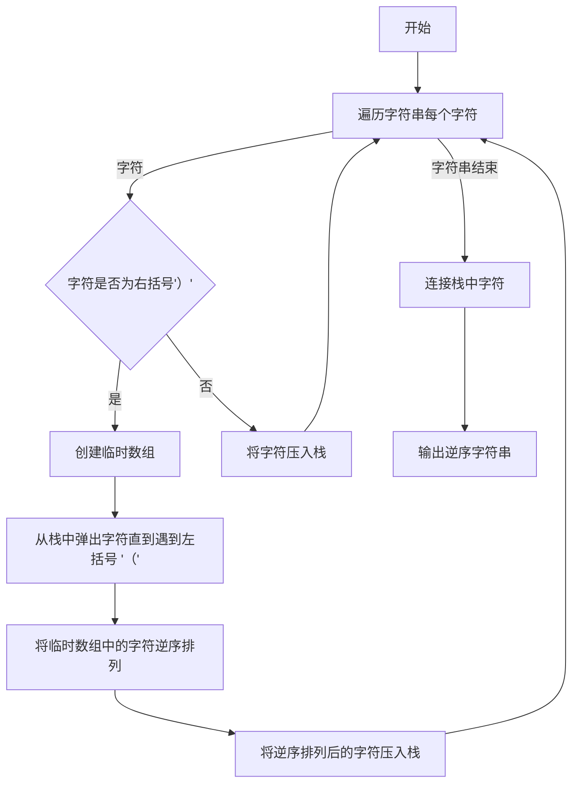
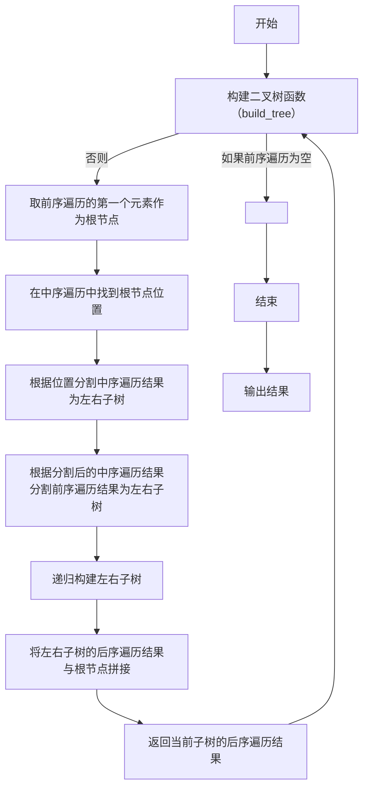
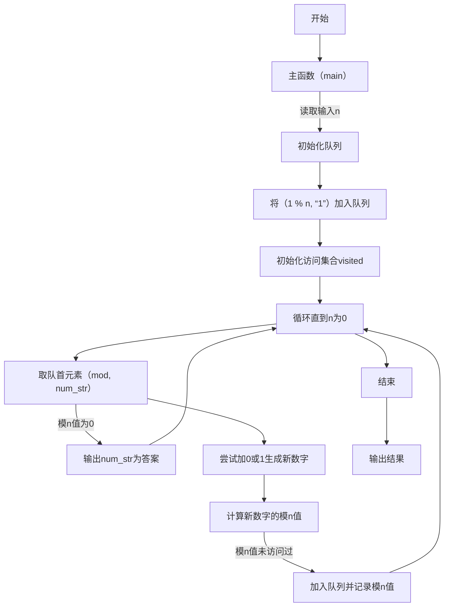
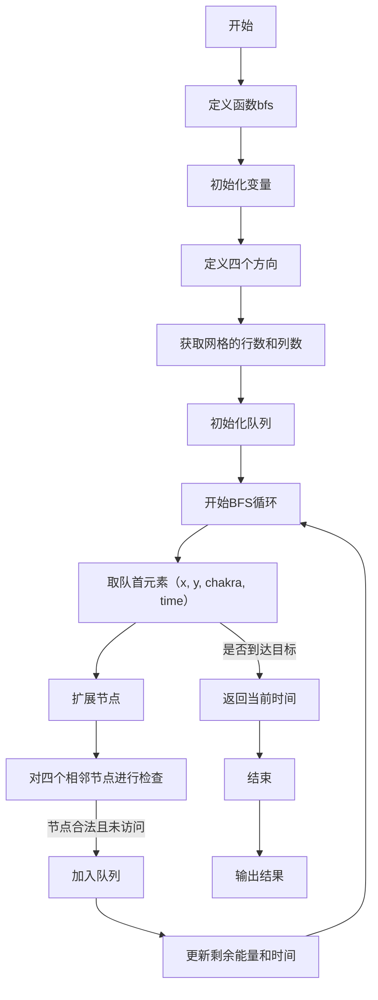
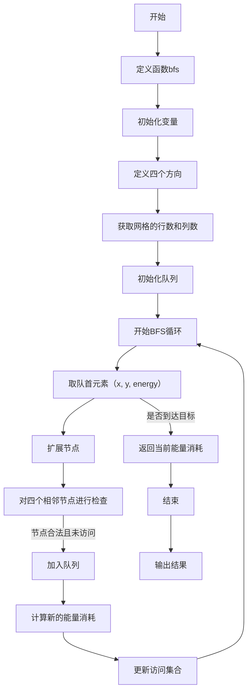
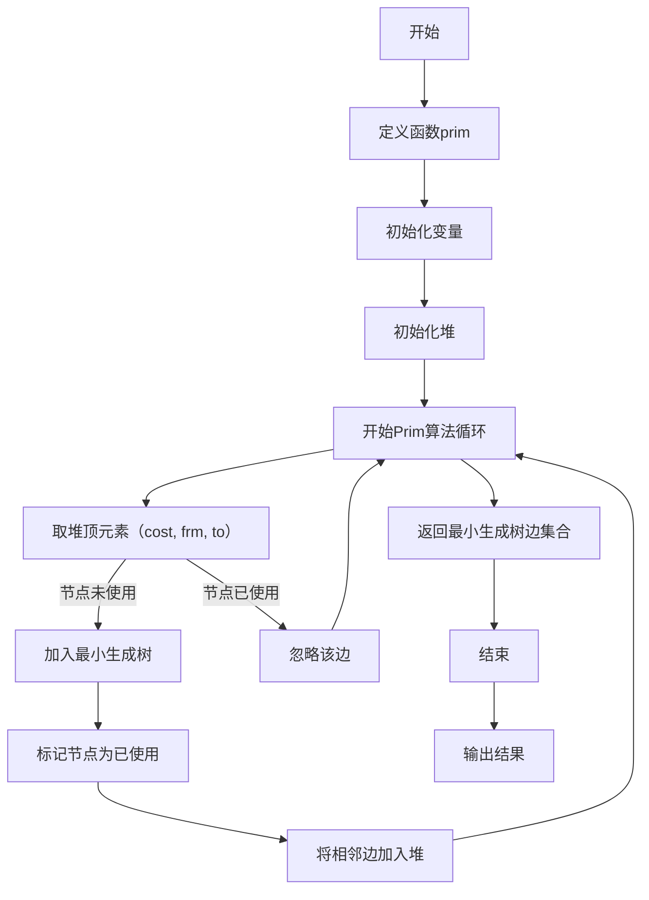

# Assignment #A: 图论：算法，树算及栈

Updated 2018 GMT+8 Apr 21, 2024

2024 spring, Complied by 杨乐山 2100011502


**说明：**

1）请把每个题目解题思路（可选），源码Python, 或者C++（已经在Codeforces/Openjudge上AC），截图（包含Accepted），填写到下面作业模版中（推荐使用 typora https://typoraio.cn ，或者用word）。AC 或者没有AC，都请标上每个题目大致花费时间。

2）提交时候先提交pdf文件，再把md或者doc文件上传到右侧“作业评论”。Canvas需要有同学清晰头像、提交文件有pdf、"作业评论"区有上传的md或者doc附件。

3）如果不能在截止前提交作业，请写明原因。


**编程环境**

操作系统：Windows 11 专业版 23H2 22631.3296

Python编程环境：PyCharm 2023.3.5 (Professional Edition)


## 1. 题目

### 20743: 整人的提词本

http://cs101.openjudge.cn/practice/20743/


思路：

1. **Stack (栈) 数据结构的使用**：代码中使用了栈来处理字符串中的括号。栈是一种后进先出（Last In First Out，LIFO）的数据结构，这种特性使其非常适合处理括号匹配问题。

2. **遍历字符串**：代码通过对字符串 `s` 进行遍历，逐个处理每个字符。

3. **括号匹配**：当遇到左括号 `(` 时，将其压入栈中。当遇到右括号 `)` 时，将栈中的元素出栈直到遇到左括号 `(`，这样就获得了括号内的字符。然后将这些字符逆序排列，并将其重新压入栈中。

4. **输出结果**：最后将栈中的字符连接起来，得到最终结果。



这个图表展示了代码的执行流程。在每一步，它会检查当前字符是不是右括号，如果是，就将栈中的字符取出直到遇到左括号，然后将这些字符逆序排列并重新压入栈中。最终，它将栈中的字符连接起来并输出结果。

代码

```python
def reverse_parentheses(s):
    stack = []
    for char in s:
        if char == ')':
            temp = []
            while stack and stack[-1] != '(':
                temp.append(stack.pop())
            # remove the opening parenthesis
            if stack:
                stack.pop()
            # add the reversed characters back to the stack
            stack.extend(temp)
        else:
            stack.append(char)
    return ''.join(stack)

# 读取输入并处理
s = input().strip()
print(reverse_parentheses(s))
```


代码运行截图


### 02255: 重建二叉树

http://cs101.openjudge.cn/practice/02255/


思路：

1. **递归构建二叉树**：代码中的 `build_tree` 函数是一个递归函数，用于构建二叉树。它的参数是前序遍历结果和中序遍历结果，返回的是后序遍历结果。

2. **确定根节点**：在每次递归调用中，首先取出前序遍历的第一个元素作为当前子树的根节点。

3. **根据根节点分割中序遍历结果**：然后在中序遍历结果中找到根节点的位置，根据这个位置将中序遍历结果分割成左子树和右子树的中序遍历结果。

4. **根据分割后的结果递归构建左右子树**：根据中序遍历结果的分割，将前序遍历结果也相应地分割成左子树和右子树的前序遍历结果，然后递归构建左右子树。

5. **返回后序遍历结果**：最后将左右子树的后序遍历结果和根节点拼接起来，形成当前子树的后序遍历结果，并返回。

以下是中文 Mermaid 流程图：



代码

```python
def build_tree(preorder, inorder):
    if not preorder:
        return ''
    
    root = preorder[0]
    root_index = inorder.index(root)
    
    left_preorder = preorder[1:1 + root_index]
    right_preorder = preorder[1 + root_index:]
    
    left_inorder = inorder[:root_index]
    right_inorder = inorder[root_index + 1:]
    
    left_tree = build_tree(left_preorder, left_inorder)
    right_tree = build_tree(right_preorder, right_inorder)
    
    return left_tree + right_tree + root

while True:
    try:
        preorder, inorder = input().split()
        postorder = build_tree(preorder, inorder)
        print(postorder)
    except EOFError:
        break
```


代码运行截图


### 01426: Find The Multiple

http://cs101.openjudge.cn/practice/01426/

要求用bfs实现


思路：

1. **使用 BFS（广度优先搜索）**：代码使用了队列来实现 BFS，从而逐层搜索满足条件的数。

2. **初始化队列**：开始时，将初始状态 `(1 % n, "1")` 加入队列中，其中第一个元素是模 n 的值，第二个元素是对应的数字字符串。

3. **记录已访问的模 n 值**：使用集合 `visited` 记录已经访问过的模 n 的值，以避免重复搜索。

4. **BFS 过程**：在每一轮中，从队列中取出一个元素 `(mod, num_str)`，其中 `mod` 是当前数字的模 n 值，`num_str` 是对应的数字字符串。

5. **检查是否找到答案**：如果 `mod` 为 0，表示找到了满足条件的数，即 `num_str`，直接返回。

6. **生成新的数字并计算模 n 值**：尝试在当前数字的后面加上 0 或 1，生成新的数字，并计算其模 n 的值。

7. **判断是否访问过**：如果新的模 n 值没有访问过，则将新的状态 `(new_mod, new_num_str)` 加入队列，并将新的模 n 值加入到 `visited` 中。

8. **重复以上步骤**：重复执行上述步骤，直到找到满足条件的数为止。

以下是中文 Mermaid 流程图：




代码

```python
from collections import deque

def find_multiple(n):
    # 使用队列实现BFS
    q = deque()
    # 初始化队列，存储的是(模n值, 对应的数字字符串)
    q.append((1 % n, "1"))
    visited = set([1 % n])  # 用于记录访问过的模n值，避免重复搜索

    while q:
        mod, num_str = q.popleft()

        # 检查当前模n值是否为0，是则找到答案
        if mod == 0:
            return num_str

        # 尝试在当前数字后加0或加1，生成新的数字，并计算模n值
        for digit in ["0", "1"]:
            new_num_str = num_str + digit
            new_mod = (mod * 10 + int(digit)) % n

            # 如果新模n值未访问过，则加入队列继续搜索
            if new_mod not in visited:
                q.append((new_mod, new_num_str))
                visited.add(new_mod)

def main():
    while True:
        n = int(input())
        if n == 0:
            break
        print(find_multiple(n))

if __name__ == "__main__":
    main()
```


代码运行截图


### 04115: 鸣人和佐助

bfs, http://cs101.openjudge.cn/practice/04115/


思路：

这段代码实现了一个广度优先搜索算法，用于在给定的网格中找到从起点到目标点的最短路径。

1. **导入模块**：代码使用了 `deque` 模块来实现队列数据结构。

2. **定义函数**：`bfs(grid, start, target, chakra)` 函数用于执行广度优先搜索。

3. **初始化变量**：定义了 `directions` 列表来表示四个方向上的移动，以及获取网格的行数和列数。

4. **初始化队列**：使用 `deque` 创建一个空队列，并将起始点 `(start, chakra, 0)` 加入队列，其中 `start` 是起始点的坐标，`chakra` 是当前剩余的能量，`0` 是初始时间。

5. **BFS 过程**：在每次循环中，从队列中取出一个元素 `(x, y)`，表示当前位置的坐标，`chakra` 表示当前剩余的能量，`time` 表示到达当前位置所花费的时间。

6. **检查是否到达目标**：如果当前位置 `(x, y)` 等于目标点 `target`，则返回当前时间 `time`。

7. **扩展节点**：对当前节点的四个相邻节点进行检查，如果相邻节点是合法的且未被访问过，则将其加入队列中。

8. **更新剩余能量和时间**：根据当前位置的情况，更新剩余能量和时间。

9. **返回结果**：如果搜索完整个网格仍未找到路径，则返回 `-1`。

以下是中文 Mermaid 流程图：




代码

```python
from collections import deque

def bfs(grid, start, target, chakra):
    directions = [(0, 1), (0, -1), (1, 0), (-1, 0)]
    m, n = len(grid), len(grid[0])
    visited = set()
    queue = deque([(start, chakra, 0)])  # (position, remaining chakra, time)
    
    while queue:
        (x, y), chakra, time = queue.popleft()
        if (x, y) == target:
            return time
        
        for dx, dy in directions:
            nx, ny = x + dx, y + dy
            if 0 <= nx < m and 0 <= ny < n and grid[nx][ny] != '#':
                if grid[nx][ny] == '+':  # If the target is encountered, return time
                    return time + 1
                if (nx, ny, chakra) not in visited:
                    visited.add((nx, ny, chakra))
                    if grid[nx][ny] == '#' and chakra > 0:
                        queue.append(((nx, ny), chakra - 1, time + 1))
                    elif grid[nx][ny] == '*':
                        queue.append(((nx, ny), chakra, time + 1))
    return -1  # If no path is found

# Example usage:
M, N, T = map(int, input().split())
grid = [input() for _ in range(M)]
start, target = None, None

for i in range(M):
    for j in range(N):
        if grid[i][j] == '@':
            start = (i, j)
        elif grid[i][j] == '+':
            target = (i, j)

result = bfs(grid, start, target, T)
print(result)
```


代码运行截图


### 20106: 走山路

Dijkstra, http://cs101.openjudge.cn/practice/20106/


思路：

1. **导入模块**：代码使用了 `deque` 模块来实现队列数据结构。

2. **定义函数**：`bfs(grid, start, target)` 函数用于执行广度优先搜索。

3. **初始化变量**：定义了 `directions` 列表来表示四个方向上的移动，以及获取网格的行数和列数。

4. **初始化队列**：使用 `deque` 创建一个空队列，并将起始点 `(start, 0)` 加入队列，其中 `start` 是起始点的坐标，`0` 是初始能量消耗。

5. **BFS 过程**：在每次循环中，从队列中取出一个元素 `(x, y)`，表示当前位置的坐标，`energy` 表示到达当前位置的能量消耗。

6. **检查是否到达目标**：如果当前位置 `(x, y)` 等于目标点 `target`，则返回当前能量消耗 `energy`。

7. **扩展节点**：对当前节点的四个相邻节点进行检查，如果相邻节点是合法的且未被访问过，则将其加入队列中。

8. **计算新的能量消耗**：根据当前位置和相邻位置的高度差计算新的能量消耗。

9. **更新访问集合**：将当前节点标记为已访问。

10. **返回结果**：如果搜索完整个网格仍未找到路径，则返回无穷大。

11. **解析输入并调用函数**：根据输入解析网格和查询，然后调用 `find_min_energy` 函数获取结果。

以下是中文 Mermaid 流程图：




代码

```python
from collections import deque

def bfs(grid, start, target):
    directions = [(0, 1), (0, -1), (1, 0), (-1, 0)]
    m, n = len(grid), len(grid[0])
    visited = set()
    queue = deque([(start, 0)])  # (position, energy)
    
    while queue:
        (x, y), energy = queue.popleft()
        if (x, y) == target:
            return energy
        
        for dx, dy in directions:
            nx, ny = x + dx, y + dy
            if 0 <= nx < m and 0 <= ny < n and grid[nx][ny] != '#':
                new_energy = energy + abs(grid[nx][ny] - grid[x][y])
                if (nx, ny) not in visited:
                    visited.add((nx, ny))
                    queue.append(((nx, ny), new_energy))
    return float('inf')  # If no path is found

# Example usage:
def find_min_energy(m, n, grid, queries):
    results = []
    for i in range(len(queries)):
        start_row, start_col, target_row, target_col = queries[i]
        start = (start_row, start_col)
        target = (target_row, target_col)
        result = bfs(grid, start, target)
        if result == float('inf'):
            results.append("NO")
        else:
            results.append(result)
    return results

# Example input parsing:
m, n, p = map(int, input().split())
grid = [list(map(int, input().split())) for _ in range(m)]
queries = [list(map(int, input().split())) for _ in range(p)]

# Example usage:
output = find_min_energy(m, n, grid, queries)
for result in output:
    print(result)
```


代码运行截图


### 05442: 兔子与星空

Prim, http://cs101.openjudge.cn/practice/05442/


思路：

这段代码实现了 Prim 算法来计算最小生成树的权重之和。让我解释一下代码的工作原理，并提供中文 Mermaid 流程图。

1. **导入模块**：代码使用了 `heapq` 模块来实现堆结构。

2. **定义 Prim 算法函数**：`prim(graph, start)` 函数用于执行 Prim 算法来生成最小生成树。

3. **初始化变量**：定义了 `mst` 列表来存储最小生成树的边，`used` 集合用于记录已经加入最小生成树的节点，`edges` 堆列表用于存储候选边。

4. **初始化堆**：将起始节点 `start` 对应的边加入堆中。

5. **Prim 算法主循环**：在每次循环中，从堆中取出代价最小的边，如果边连接的节点 `to` 不在已经加入最小生成树的节点集合中，则将这条边加入最小生成树，并将连接的节点标记为已使用，然后将连接节点的未加入最小生成树的相邻边加入堆中。

6. **返回结果**：最终返回最小生成树的边集合 `mst`。

7. **解析输入并调用函数**：根据输入解析图的结构，并调用 `solve` 函数进行求解。

以下是中文 Mermaid 流程图：



这个流程图描述了代码的执行流程，使用了中文来说明每个步骤。

代码

```python
import heapq

def prim(graph, start):
    mst = []
    used = set([start])
    edges = [
        (cost, start, to)
        for to, cost in graph[start].items()
    ]
    heapq.heapify(edges)

    while edges:
        cost, frm, to = heapq.heappop(edges)
        if to not in used:
            used.add(to)
            mst.append((frm, to, cost))
            for to_next, cost2 in graph[to].items():
                if to_next not in used:
                    heapq.heappush(edges, (cost2, to, to_next))

    return mst

def solve():
    n = int(input())
    graph = {chr(i+65): {} for i in range(n)}
    for i in range(n-1):
        data = input().split()
        star = data[0]
        m = int(data[1])
        for j in range(m):
            to_star = data[2+j*2]
            cost = int(data[3+j*2])
            graph[star][to_star] = cost
            graph[to_star][star] = cost
    mst = prim(graph, 'A')
    print(sum(x[2] for x in mst))

solve()
```


代码运行截图 


## 2. 学习总结和收获

作业让我从五一假期中不得不再次捡起数算进行一波温习🥹
