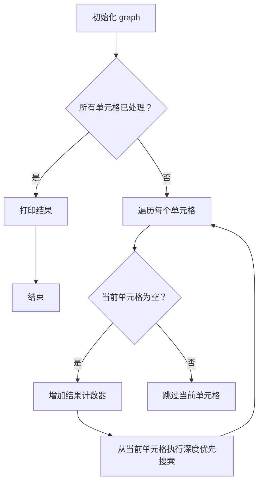
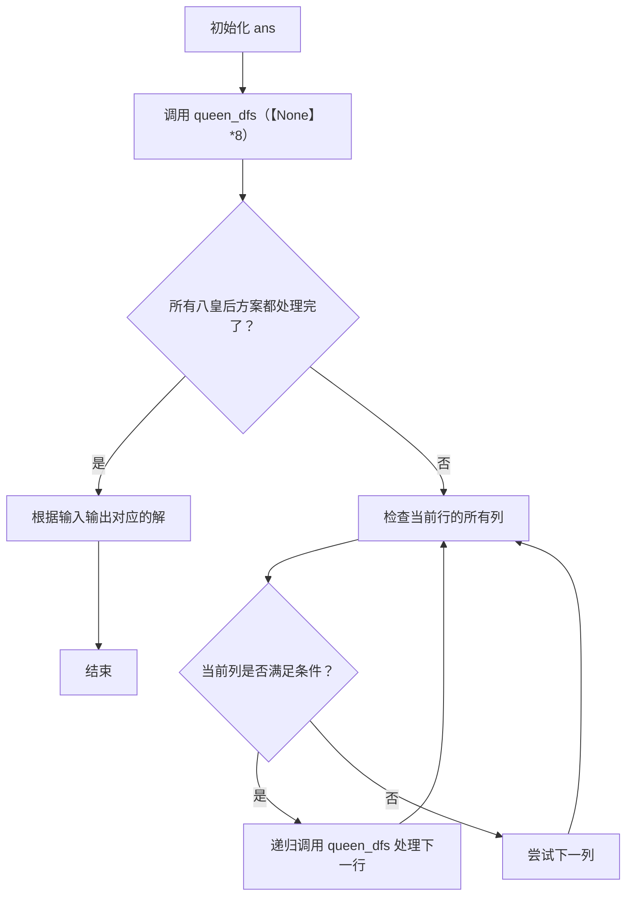
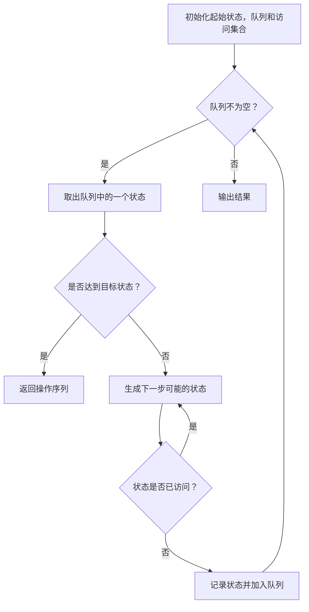
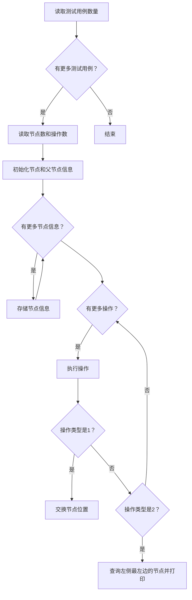
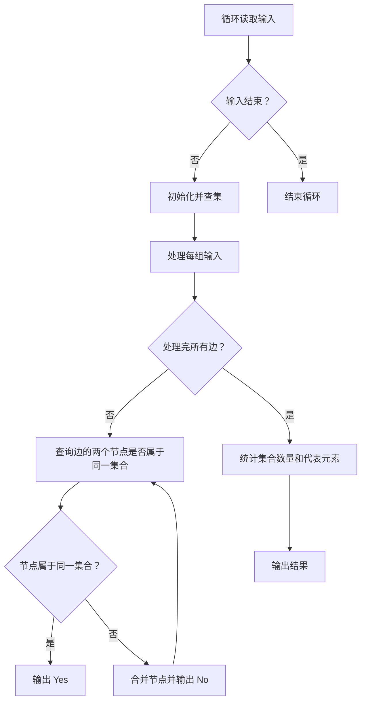
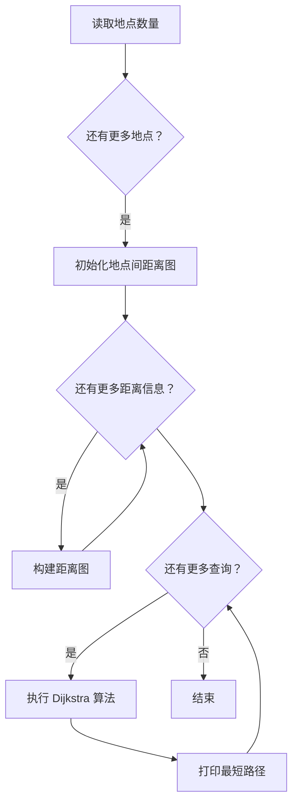

# Assignment #B: 图论和树算

Updated 1709 GMT+8 Apr 28, 2024

2024 spring, Complied by 杨乐山 2100011502


**说明：**

1）请把每个题目解题思路（可选），源码Python, 或者C++（已经在Codeforces/Openjudge上AC），截图（包含Accepted），填写到下面作业模版中（推荐使用 typora https://typoraio.cn ，或者用word）。AC 或者没有AC，都请标上每个题目大致花费时间。

2）提交时候先提交pdf文件，再把md或者doc文件上传到右侧“作业评论”。Canvas需要有同学清晰头像、提交文件有pdf、"作业评论"区有上传的md或者doc附件。

3）如果不能在截止前提交作业，请写明原因。


**编程环境**

操作系统：Windows 11 专业版 23H2 22631.3296

Python编程环境：PyCharm 2023.3.5 (Professional Edition)


## 1. 题目

### 28170: 算鹰

dfs, http://cs101.openjudge.cn/practice/28170/


思路：

1. **函数 `dfs(x, y)`:**
   - 这个函数接受两个参数 `x` 和 `y`，表示当前单元格的坐标。
   - 它将当前单元格标记为已访问，将其值改为 `"-"`。
   - 然后，它检查四个方向上的相邻单元格：上、下、左、右。
   - 如果相邻单元格在网格范围内并且包含 `"."`（表示未访问），则递归调用 `dfs()` 函数访问该单元格。

2. **主要代码:**
   - 初始化了一个空列表 `graph` 用于表示二维网格。
   - 遍历 10 行输入以填充 `graph`。
   - 对于每个单元格（`"."` 表示空单元格），增加结果计数器，并从该单元格开始执行 DFS，如果尚未访问过的话。
   - 最后打印结果计数器。



从初始化 `graph` 开始，然后检查每个单元格，如果单元格为空，则增加结果计数器，并且开始深度优先搜索，直到所有单元格都被处理。

代码

```python
def dfs(x,y):
    graph[x][y] = "-"
    for dx,dy in [(1,0),(-1,0),(0,1),(0,-1)]:
        if 0<=x+dx<10 and 0<=y+dy<10 and graph[x+dx][y+dy] == ".":
            dfs(x+dx,y+dy)
graph = []
result = 0
for i in range(10):
    graph.append(list(input()))
for i in range(10):
    for j in range(10):
        if graph[i][j] == ".":
            result += 1
            dfs(i,j)
print(result)
```


代码运行截图


### 02754: 八皇后

dfs, http://cs101.openjudge.cn/practice/02754/


思路：

1. **函数 `queen_dfs(A, cur=0)`:**
   - 这个函数是递归的，用于尝试在第 `cur` 行放置皇后。
   - 它遍历了当前行的所有列，检查是否可以放置皇后，如果满足条件则递归调用自身来处理下一行。
   - 放置的条件是：新放置的皇后不能与之前的皇后在同一列或对角线上。

2. **主要代码:**
   - 创建了一个空列表 `ans` 用于存储所有符合条件的八皇后解。
   - 调用 `queen_dfs([None]*8)` 来开始解决八皇后问题。
   - 根据输入的次数，依次输出对应位置的八皇后解。

这段代码通过深度优先搜索枚举了所有可能的八皇后放置情况，并将符合条件的解存储在 `ans` 列表中，然后根据输入输出对应的解。接下来，我们使用 Mermaid 符号绘制流程图：



从初始化 `ans` 开始，然后递归地处理每一行的所有列，直到所有八皇后方案都被处理完毕。

代码

```python
ans = []
def queen_dfs(A, cur = 0):                                       #对于一个边长为某数的棋盘，我们来考虑第cur行的皇后放置情况
    for col in range(len(A)):                                    #对于这一行中的所有列考虑皇后放置可行性
        for row in range(cur):                                   #现在来看之前已经放置过的皇后会不会和在第col列的新放置皇后产生冲突
            if col == A[row] or abs(col - A[row]) == cur - row:  #如果产生了冲突
                break                                            #col列不可以放置皇后
        else:                                                    #如果不产生冲突
            A[cur] = col                                         #那么棋盘的cur行col列可以放置一个新的皇后
            queen_dfs(A, cur + 1)                                #那么接着考虑下一行的情况（套娃）
    if cur == len(A):                                            #考虑完了
        ans.append(''.join(str(x+1) for x in A))                 #作为一种安排放进列表中，以备调用
queen_dfs([None]*8)                                              #国际象棋棋盘是8*8大小
for _ in range(int(input())):
    print(ans[int(input()) - 1])
```


代码运行截图


### 03151: Pots

bfs, http://cs101.openjudge.cn/practice/03151/


思路：

1. **函数 `bfs(A, B, C)`:**
   - 使用 BFS 算法来搜索从初始状态到目标状态的最短路径。
   - 定义了起始状态 `(0, 0)`，表示两个水桶都是空的。
   - 使用队列来保存待访问的状态，同时使用集合 `visited` 来避免重复访问相同的状态。
   - 每次取出队列中的一个状态 `(a, b)`，其中 `a` 和 `b` 表示两个水桶中的水量，同时也记录了到达当前状态的操作序列 `actions`。
   - 遍历当前状态的所有可能下一步状态，并将未访问的状态加入队列中，并更新访问记录和操作序列。
   - 当某个状态的水量等于目标水量 `C` 时，返回该状态对应的操作序列。

2. **函数 `get_action(a, b, next_state)`:**
   - 根据当前状态和下一状态，确定对应的操作是倒满、倒空还是倒水。

3. **主要代码:**
   - 读取输入的三个参数：两个水桶的容量 `A` 和 `B`，以及目标水量 `C`。
   - 调用 `bfs(A, B, C)` 来获取解决方案。
   - 如果找不到解决方案，则输出 `"impossible"`，否则输出操作序列的长度以及具体的操作。



从初始化起始状态、队列和访问集合开始，然后不断地从队列中取出状态进行处理，直到找到目标状态或队列为空为止。

代码

```python
def bfs(A, B, C):
    start = (0, 0)
    visited = set()
    visited.add(start)
    queue = [(start, [])]

    while queue:
        (a, b), actions = queue.pop(0)

        if a == C or b == C:
            return actions

        next_states = [(A, b), (a, B), (0, b), (a, 0), (min(a + b, A),\
                max(0, a + b - A)), (max(0, a + b - B), min(a + b, B))]

        for i in next_states:
            if i not in visited:
                visited.add(i)
                new_actions = actions + [get_action(a, b, i)]
                queue.append((i, new_actions))

    return ["impossible"]


def get_action(a, b, next_state):
    if next_state == (A, b):
        return "FILL(1)"
    elif next_state == (a, B):
        return "FILL(2)"
    elif next_state == (0, b):
        return "DROP(1)"
    elif next_state == (a, 0):
        return "DROP(2)"
    elif next_state == (min(a + b, A), max(0, a + b - A)):
        return "POUR(2,1)"
    else:
        return "POUR(1,2)"


A, B, C = map(int, input().split())
solution = bfs(A, B, C)

if solution == ["impossible"]:
    print(solution[0])
else:
    print(len(solution))
    for i in solution:
        print(i)
```


代码运行截图


### 05907: 二叉树的操作

http://cs101.openjudge.cn/practice/05907/


思路：

1. **函数 `find_leftmost_node(son, u)`:**
   - 这个函数用于找到以节点 `u` 为根节点的子树中最左侧的节点。
   - 通过不断向左子节点移动，直到左子节点为空为止，返回当前节点的值。

2. **函数 `main()`:**
   - 首先读取测试用例的数量 `t`。
   - 对于每个测试用例：
     - 读取节点数 `n` 和操作数 `m`。
     - 创建一个数组 `son` 来存储每个节点的子节点。
     - 创建一个字典 `parent` 来存储每个节点的父节点和方向。
     - 对于每个节点，将其子节点和父节点信息存储在 `son` 和 `parent` 中。
     - 对于每个操作：
       - 如果是类型 1 操作，交换两个节点的位置。
       - 如果是类型 2 操作，找到以节点 `u` 为根节点的子树中最左侧的节点并打印。

3. **主要代码:**
   - 根据输入的命令类型执行相应的操作，实现了节点位置的交换和查询左侧最左边的节点。



从读取测试用例数量开始，然后依次读取节点信息和操作，根据操作类型执行相应的操作，直到处理完所有的测试用例。

代码

```python
def find_leftmost_node(son, u):
    while son[u][0] != -1:
        u = son[u][0]
    return u

def main():
    t = int(input())
    for _ in range(t):
        n, m = map(int, input().split())

        son = [-1] * (n + 1)  # 存储每个节点的子节点
        parent = {}  # 存储每个节点的父节点和方向，{节点: (父节点, 方向)}

        for _ in range(n):
            i, u, v = map(int, input().split())
            son[i] = [u, v]
            parent[u] = (i, 0)  # 左子节点
            parent[v] = (i, 1)  # 右子节点

        for _ in range(m):
            s = input().split()
            if s[0] == "1":
                u, v = map(int, s[1:])
                fu, diru = parent[u]
                fv, dirv = parent[v]
                son[fu][diru] = v
                son[fv][dirv] = u
                parent[v] = (fu, diru)
                parent[u] = (fv, dirv)
            elif s[0] == "2":
                u = int(s[1])
                root = find_leftmost_node(son, u)
                print(root)

if __name__ == "__main__":
    main()
```


代码运行截图


### 18250: 冰阔落 I

Disjoint set, http://cs101.openjudge.cn/practice/18250/


思路：

1. **函数 `find(x)`:**
   - 这个函数用于查找元素 `x` 所属的集合的根节点，并进行路径压缩，即将查找路径上的所有节点直接连接到根节点，以减少后续查找的时间。
   - 如果 `x` 的父节点不是自己，则递归地查找 `x` 的父节点，同时更新 `x` 的父节点为根节点。
   - 返回 `x` 所属集合的根节点。

2. **函数 `union(x, y)`:**
   - 这个函数用于合并元素 `x` 和元素 `y` 所属的集合。
   - 首先找到 `x` 和 `y` 的根节点 `root_x` 和 `root_y`。
   - 如果 `root_x` 和 `root_y` 不相等，表示它们属于不同的集合，那么将其中一个根节点的父节点指向另一个根节点，以合并两个集合。

3. **主要代码:**
   - 不断循环读取输入，直到文件结束。
   - 对于每组输入：
     - 初始化并查集的 `parent` 数组，使每个元素的父节点都是自己。
     - 依次处理每个输入的 `m` 条边，如果两个节点已经属于同一个集合，则输出 `Yes`，否则将它们合并，并输出 `No`。
     - 最后统计集合数量和每个集合的代表元素。



从循环读取输入开始，然后依次处理每组输入，直到处理完所有输入为止。

代码

```python
def find(x):
    if parent[x] != x:
        parent[x] = find(parent[x])
    return parent[x]

def union(x, y):
    root_x = find(x)
    root_y = find(y)
    if root_x != root_y:
        parent[root_y] = root_x

while True:
    try:
        n, m = map(int, input().split())
        parent = list(range(n + 1))

        for _ in range(m):
            a, b = map(int, input().split())
            if find(a) == find(b):
                print('Yes')
            else:
                print('No')
                union(a, b)

        unique_parents = set(find(x) for x in range(1, n + 1))  # 获取不同集合的根节点
        ans = sorted(unique_parents)  # 输出有冰阔落的杯子编号
        print(len(ans))
        print(*ans)

    except EOFError:
        break
```


代码运行截图


### 05443: 兔子与樱花

http://cs101.openjudge.cn/practice/05443/


思路：

1. **函数 `dijkstra(graph, start, end, P)`:**
   - 这个函数用于执行 Dijkstra 算法来找出图 `graph` 中从起始点 `start` 到结束点 `end` 的最短路径。
   - 初始化距离字典 `dist`，其中键是图中的节点，值是一个元组，表示到达该节点的最短距离和路径。
   - 使用堆 `pos` 来存储待处理的节点，初始时将起始节点放入堆中。
   - 不断从堆中弹出距离最小的节点，更新与该节点相邻的节点的最短距离和路径，并将其加入堆中。
   - 当堆为空时，表示所有节点都已处理完毕，返回结束节点的最短路径。

2. **主要代码:**
   - 读取输入 `P`，表示地点的数量。
   - 初始化空字典 `graph`，用于存储地点间的距离。
   - 根据输入构建地点的距离图。
   - 对于每个查询：
     - 使用 Dijkstra 算法找出最短路径。
     - 根据路径打印出对应的节点和距离。



从读取地点数量开始，然后依次构建距离图、执行 Dijkstra 算法以及打印最短路径，直到处理完所有查询。

代码

```python
import heapq
import math
def dijkstra(graph,start,end,P):
    if start == end: return []
    dist = {i:(math.inf,[]) for i in graph}
    dist[start] = (0,[start])
    pos = []
    heapq.heappush(pos,(0,start,[]))
    while pos:
        dist1,current,path = heapq.heappop(pos)
        for (next,dist2) in graph[current].items():
            if dist2+dist1 < dist[next][0]:
                dist[next] = (dist2+dist1,path+[next])
                heapq.heappush(pos,(dist1+dist2,next,path+[next]))
    return dist[end][1]

P = int(input())
graph = {input():{} for _ in range(P)}
for _ in range(int(input())):
    place1,place2,dist = input().split()
    graph[place1][place2] = graph[place2][place1] = int(dist)

for _ in range(int(input())):
    start,end = input().split()
    path = dijkstra(graph,start,end,P)
    s = start
    current = start
    for i in path:
        s += f'->({graph[current][i]})->{i}'
        current = i
    print(s)
```


代码运行截图


## 2. 学习总结和收获

八皇后让我意识到原来我大一的时候那么厉害😂


