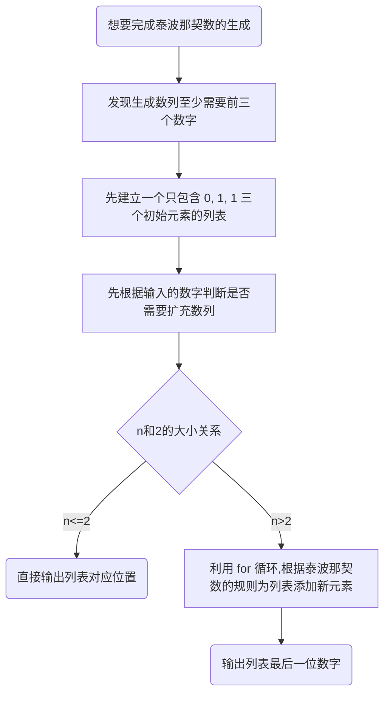
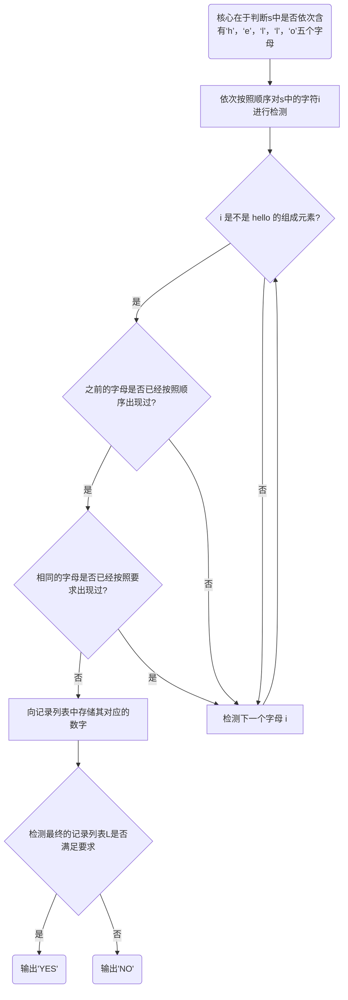
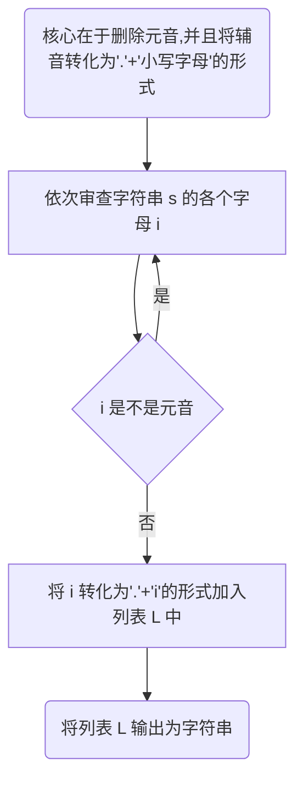
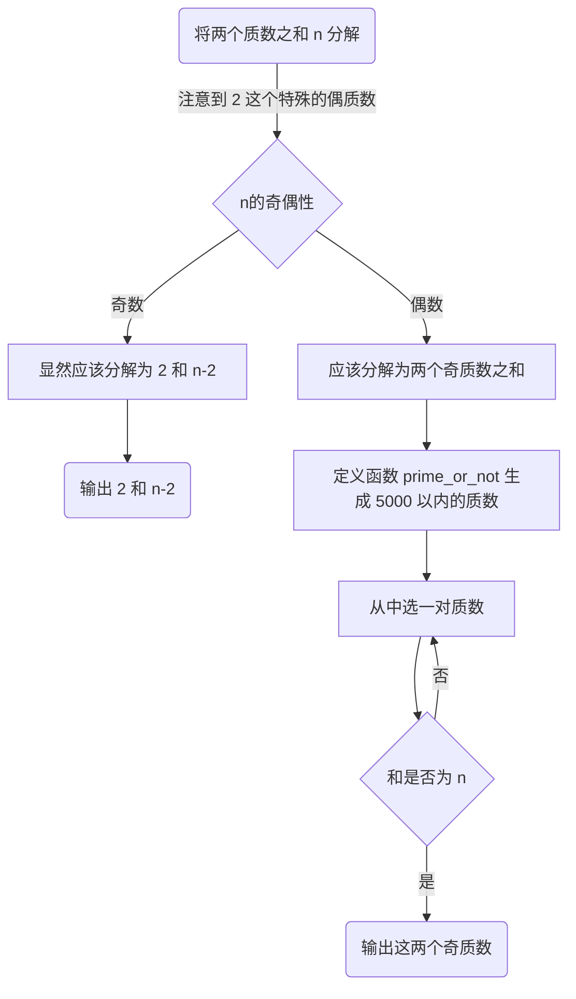
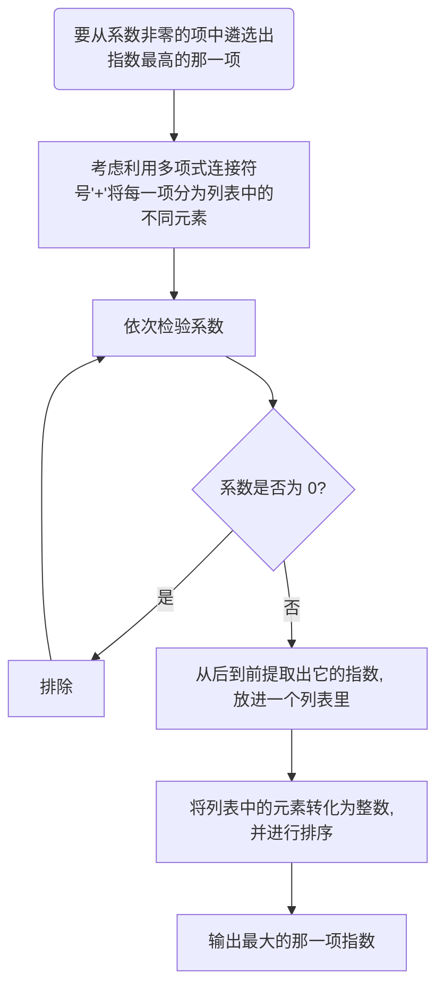
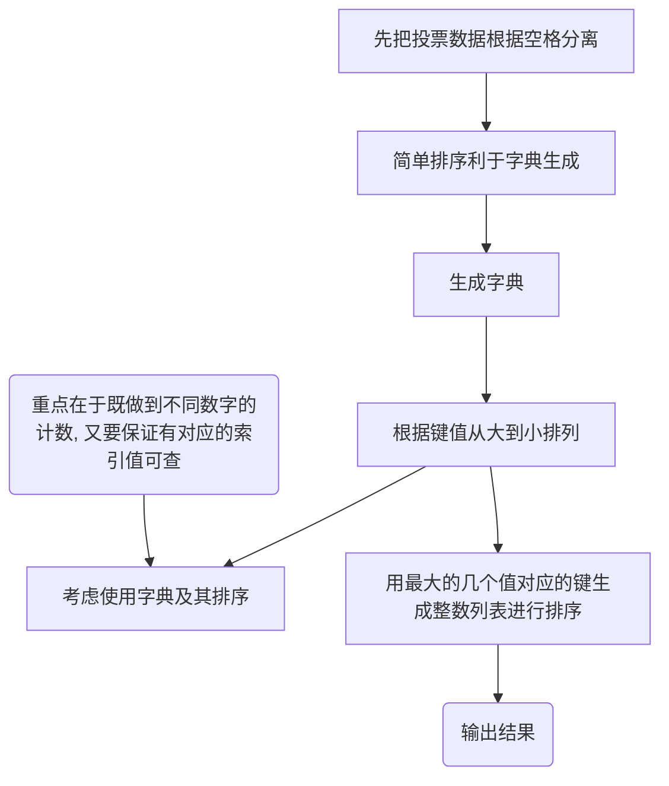

# Assignment #1: 拉齐大家Python水平

Updated 1503 GMT+8 Feb 26, 2024

2024 spring, Complied by 杨乐山 物理学院 2100011502


**说明：**

1）数算课程的先修课是计概，由于计概学习中可能使用了不同的编程语言，而数算课程要求Python语言，因此第一周作业练习Python编程。如果有同学坚持使用C/C++，也可以，但是建议也要会Python语言。

2）请把每个题目解题思路（可选），源码Python, 或者C++（已经在Codeforces/Openjudge上AC），截图（包含Accepted），填写到下面作业模版中（推荐使用 typora https://typoraio.cn ，或者用word）。AC 或者没有AC，都请标上每个题目大致花费时间。

3）课程网站是Canvas平台, https://pku.instructure.com, 学校通知3月1日导入选课名单后启用。**作业写好后，保留在自己手中，待3月1日提交。**

提交时候先提交pdf文件，再把md或者doc文件上传到右侧“作业评论”。Canvas需要有同学清晰头像、提交文件有pdf、"作业评论"区有上传的md或者doc附件。

4）如果不能在截止前提交作业，请写明原因。


**编程环境**

操作系统：Windows 11 专业版	23H2 22631.3155

Python编程环境：PyCharm 2023.3.3 (Professional Edition)


## 1. 题目

### 20742: 泰波拿契數

http://cs101.openjudge.cn/practice/20742/


思路：



##### 代码

```python
n = int(input())  
T=[0,1,1]  
if n > 2:  
    for i in range(3,n+1):  
        T.append(int(T[i-1]+T[i-2]+T[i-3]))  
print(T[-1])
```


代码运行截图


### 58A. Chat room

greedy/strings, 1000, http://codeforces.com/problemset/problem/58/A


思路：



##### 代码

```python
s = input()  
L = []  
for i in s:  
    if i == 'h':  
        if 1 not in L:  
            L.append(1)  
    elif i == 'e' and L == [1]:  
        if 2 not in L:  
            L.append(2)  
    elif i == 'l' and 1 in L and 2 in L:  
        if 3 not in L:  
            L.append(3)  
        elif 4 not in L:  
            L.append(4)  
    elif i == 'o' and L == [1, 2, 3, 4]:  
        if 5 not in L:  
            L.append(5)  
  
if L == [1,2,3,4,5]:  
    print('YES')  
else:  
    print('NO')
```


代码运行截图 


### 118A. String Task

implementation/strings, 1000, http://codeforces.com/problemset/problem/118/A


思路：



##### 代码

```python
s = input()  
L = []  
vowels = ['A', 'a', 'E', 'e', 'I', 'i', 'O', 'o', 'U', 'u', 'Y', 'y']  
for i in s:  
    if i not in vowels:  
        L.append('.'+str.lower(i))  
print(''.join(L))
```


代码运行截图


### 22359: Goldbach Conjecture

http://cs101.openjudge.cn/practice/22359/


思路：



##### 代码

```python
n = int(input())  
  
def prime_or_not():  
    L = []  
    for num in range(1,5000):  
        if num > 1:  
            for i in range(2, num):  
                if num % i == 0:  
                    break  
            else:  
                L.append(num)  
    return L  
  
if n % 2 == 1:  
    print('2 '+str(n-2))  
else:  
    for x in prime_or_not():  
        if n-x in prime_or_not():  
            print(str(x)+' '+str(n-x))  
            break
```


代码运行截图


### 23563: 多项式时间复杂度

http://cs101.openjudge.cn/practice/23563/


思路：



##### 代码

```python
s = input()+'+'  
monomial = []  
polynomial = []  
i = 0  
  
while i < len(s):  
    if s[i] != '+':  
        monomial.append(s[i])  
    else:  
        polynomial.append(''.join(monomial))  
        monomial = []  
    i += 1  
  
exponents = []  
exponent = []  
for x in range(len(polynomial)):  
    if polynomial[x][0] != '0':  
        for y in range(len(polynomial[x])-1,-1,-1):  
            if polynomial[x][y] in '0123456789':  
                exponent.append(polynomial[x][y])  
            elif polynomial[x][y] == '^':  
                exponent.reverse()  
                exponents.append(int(''.join(exponent)))  
                exponent = []  
                break  
exponents.sort()  
print('n^' + str(exponents[-1]))
```


代码运行截图


### 24684: 直播计票

http://cs101.openjudge.cn/practice/24684/


思路：



##### 代码

```python
l = input().split()  
l.sort()  
times = {}  
nums = []  
  
for i in l:  
    if i not in times:  
        times[i] = 0  
    nums.append(i)  
    times[i] += 1  
  
  
sorted_times = sorted(times.items(), reverse=True, key=lambda x:x[1])  
  
  
output = []  
for x in range(len(sorted_times)):  
    if sorted_times[x][1] >= sorted_times[x-1][1]:  
        output.append(int(sorted_times[x][0]))  
    else:  
        break  
  
output.sort()  
print(' '.join(str(x) for x in output))
```


代码运行截图


## 2. 学习总结和收获

大一的时候选修过闫老师的计概B，感受很棒，所以一看到闫老师开数算B，立刻就选了课！
由于我很长一段时间没有接触Python，于是这次作业是我的依次绝佳"复健"机会——我通过独立完成作业题重新开始熟悉python语法。
个人感受是，相比于第一次接触python，复健的速度明显加快，我还注意到了一些自己曾经忽视的地方，可以让自己有进一步的提升。

p.s. 个人感觉pycharm的代码自动联想功能很好用，可以帮助我在思绪混乱的时候重新厘清思路，我会给予很好的评价👍👍👍


