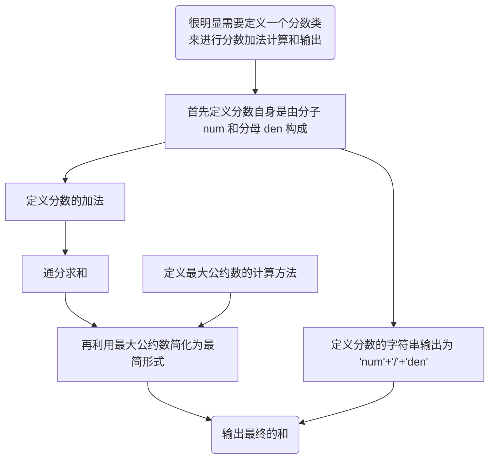
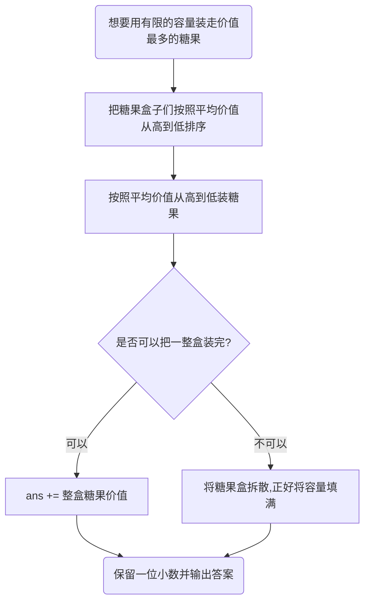
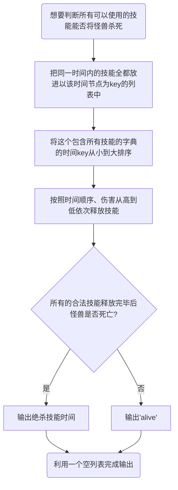
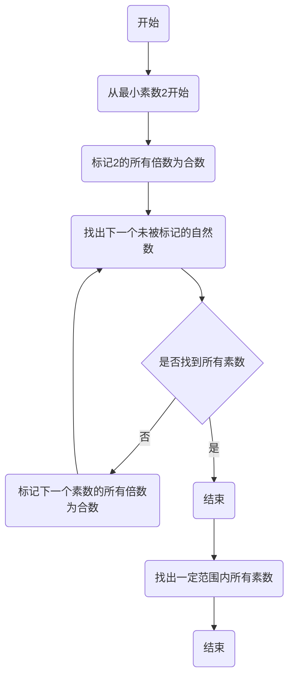
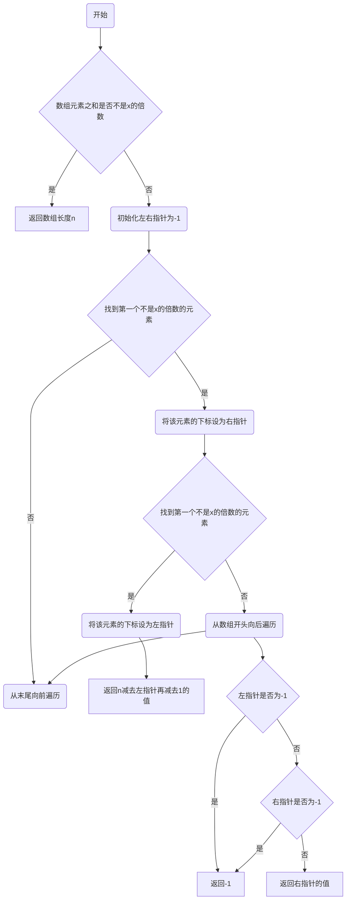

# Assignment #2: 编程练习

Updated 0953 GMT+8 Feb 24, 2024

2024 spring, Complied by 杨乐山 2100011502


**说明：**

1）The complete process to learn DSA from scratch can be broken into 4 parts:
- Learn about Time and Space complexities
- Learn the basics of individual Data Structures
- Learn the basics of Algorithms
- Practice Problems on DSA

2）请把每个题目解题思路（可选），源码Python, 或者C++（已经在Codeforces/Openjudge上AC），截图（包含Accepted），填写到下面作业模版中（推荐使用 typora https://typoraio.cn ，或者用word）。AC 或者没有AC，都请标上每个题目大致花费时间。

3）课程网站是Canvas平台, https://pku.instructure.com, 学校通知3月1日导入选课名单后启用。**作业写好后，保留在自己手中，待3月1日提交。**

提交时候先提交pdf文件，再把md或者doc文件上传到右侧“作业评论”。Canvas需要有同学清晰头像、提交文件有pdf、"作业评论"区有上传的md或者doc附件。

4）如果不能在截止前提交作业，请写明原因。


**编程环境**

操作系统：Windows 11 专业版 23H2 22631.3155

Python编程环境：PyCharm 2023.3.3 (Professional Edition)


## 1. 题目

### 27653: Fraction类

http://cs101.openjudge.cn/2024sp_routine/27653/


思路：




##### 代码

```python
import fractions

fracs = input().split()

def gcd(a,b):
    for i in range(min(a,b),0,-1):
        if a%i == 0 and b%i == 0:
            return i
            break

class Fraction:
    def __init__(self,num,den):
        self.num = int(num)
        self.den = int(den)

    def __add__(self,other):
        newnum = self.num*other.den+other.num*self.den
        newden = self.den*other.den
        commcn = gcd(newnum,newden)
        return Fraction(newnum/commcn,newden/commcn)

    def __str__(self):
        return str(self.num)+'/'+str(self.den)


f1 = Fraction(fracs[0],fracs[1])
f2 = Fraction(fracs[2],fracs[3])
f3 = f1 + f2

print(str(f3))
```


代码运行截图


### 04110: 圣诞老人的礼物-Santa Clau’s Gifts

greedy/dp, http://cs101.openjudge.cn/practice/04110


思路：




##### 代码

```python
N, W = map(int, input().split())
l = []

for i in range(N):
    l.append(list(map(int, input().split())))

for j in range(N):
    l[j].append(l[j][0]/l[j][1])

l_sorted = sorted(l,key=(lambda x:x[2]),reverse=True)

ans = 0

for i in range(N):
    if W >= l_sorted[i][1]:
        ans += l_sorted[i][0]
        W -= l_sorted[i][1]
    else:
        ans += l_sorted[i][2] * W
        break

print('%.1f' % ans)
```


代码运行截图


### 18182: 打怪兽

implementation/sortings/data structures, http://cs101.openjudge.cn/practice/18182/


思路：




##### 代码

```python
nCases = int(input())
ans = []

for i in range(nCases):
    n, m, b = map(int, input().split())
    skills = {}
    for j in range(n):
        t, x = map(int, input().split())
        if t not in skills.keys():
            skills[t] = [x]
        else:
            skills[t].append(x)
    skills_time = sorted(skills)

    for j in skills_time:
        skills[j].sort(reverse=True)
        if m >= len(skills[j]):
            b -= sum(skills[j])
        else:
            b -= sum(skills[j][0:m])

        if b <= 0:
            ans.append(str(j))
            break

    if b > 0:
        ans.append('alive')
print('\n'.join(ans))
```


代码运行截图

 


### 230B. T-primes

binary search/implementation/math/number theory, 1300, http://codeforces.com/problemset/problem/230/B


思路：说来惭愧，这个代码还是我在21秋季学期写出来的。而现在的尝试反而会超时，所以我就在这分析一下我的这个“远古”代码的思路吧。

为了快速筛选prime，采用了**埃拉托斯特尼筛法**（古希腊语：κόσκινον Ἐρατοσθένους，英语：sieve of Eratosthenes），简称**埃氏筛**，是一种用来生成素数的筛法，得名于古希腊数学家埃拉托斯特尼。其基本步骤是从最小的素数2开始，将该素数的所有倍数标记成合数合數，而下一个尚未被标记的最小自然数3即是下一个素数。如此重复这一过程，将各个素数的倍数标记为合数并找出下一个素数，最终便可找出一定范围内所有素数。




##### 代码

```python
def prime():
    flag = [0]*(10**6+1)
    for i in range(2):
        flag[i] = 1
    for i in range(2, 10**6+1):
        if flag[i] == 0:
            for j in range(i*i, 10**6+1, i):  #原理上可行，可以节省时间
                flag[j] = 1
    return flag
 
n = int(input())
l = [int(x) for x in input().split()]
flags = prime()
for i in range(n):
    a = l[i] **(1/2)
    if a %1 != 0:
        print('NO')
    else:
        a = int(a)
        if flags[a] == 0:
            print('YES')
        else:
            print('NO')
```


代码运行截图 


### 1364A. XXXXX

brute force/data structures/number theory/two pointers, 1200, https://codeforces.com/problemset/problem/1364/A


思路：由于子数组既可能从左边开始，也有可能从右边开始，那么可以考虑使用双指针辅助判断。

首先判断整个数组能否被x整除，如果不可以，那么最长的数组就是a本身。

如果可以被整除，那么我们只需要本别从左和从右开始寻找第一个不能被x整除的数字即可。




##### 代码

```python
def longest_non_divisible_subarray(n, x, a):
    if sum(a) % x != 0:
        return n

    left = right = -1
    for i in range(n):
        if a[i] % x != 0:
            left = i
            break

    for i in range(n-1, -1, -1):
        if a[i] % x != 0:
            right = i
            break

    if left == -1 or right == -1:
        return -1

    return max(n - left - 1, right)


t = int(input())
for _ in range(t):
    n, x = map(int, input().split())
    a = list(map(int, input().split()))
    print(longest_non_divisible_subarray(n, x, a))
```


代码运行截图


### 18176: 2050年成绩计算

http://cs101.openjudge.cn/practice/18176/


思路：基于T-prime的一个简单的题目，只要把T-prime的几个痛点都解决，这题没有什么特别的困难点。


##### 代码

```python
def prime():
    flag = [0] * (10 ** 4 + 1)
    for i in range(2):
        flag[i] = 1
    for i in range(2, 10 ** 4 + 1):
        if flag[i] == 0:
            for j in range(i * i, 10 ** 4 + 1, i):  # 原理上可行，可以节省时间
                flag[j] = 1
    return flag

prime_flag = prime()

m, n = map(int, input().split())
for _ in range(m):
    l = list(map(int, input().split()))
    points = 0
    for i in range(len(l)):
        a = l[i] ** (1 / 2)
        if a % 1 == 0:
            a = int(a)
            if prime_flag[a] == 0:
                points += l[i]
    if points == 0:
        print('0')
    else:
        print('%.2f' % (points/len(l)))
```


代码运行截图


## 2. 学习总结和收获

这次作业给我的最大收获就是学会了“类“，我相信这个环境会在我以后的学习中提供很多帮助。

最有趣的是我的“考古式”写作业，还得靠三年前的作业来为先在的我提供思路，说明我的复健之路任重而道远啊。🤦‍

