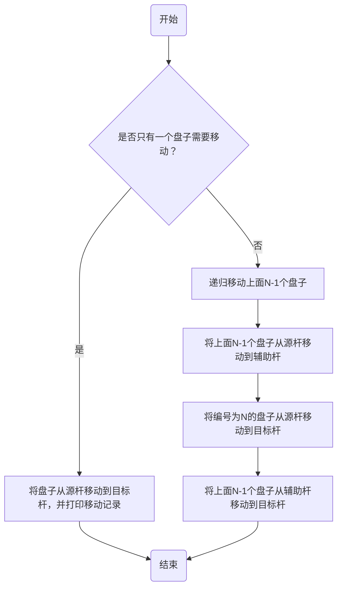
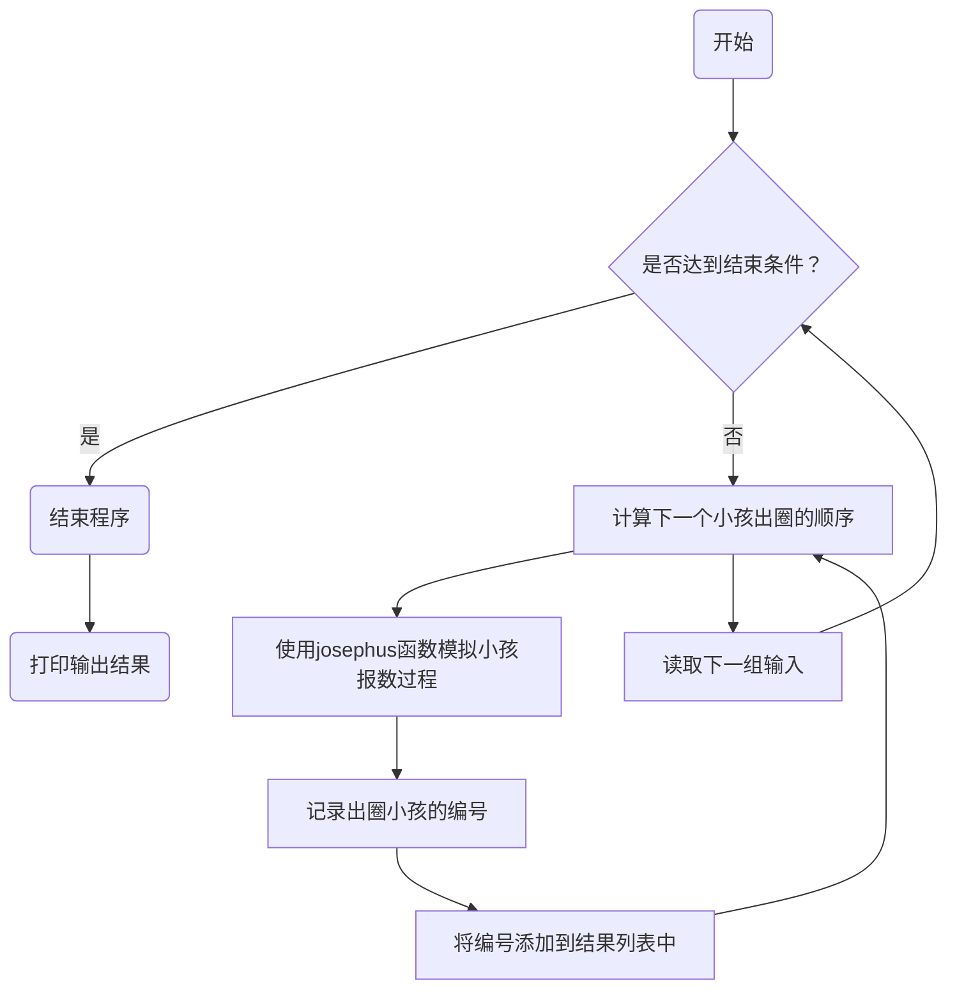
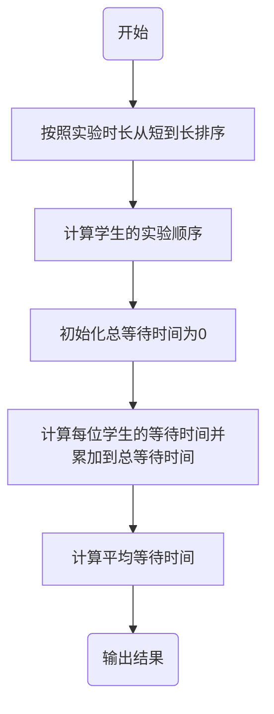
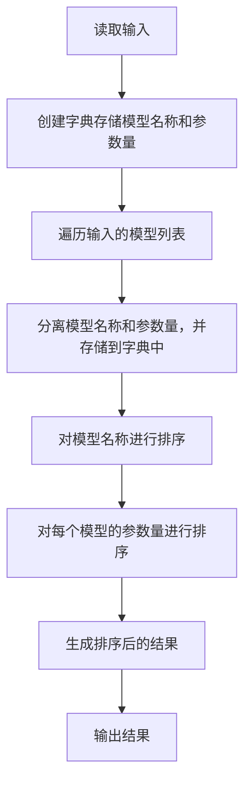

# Assignment #3: March月考

Updated 1537 GMT+8 March 6, 2024

2024 spring, Complied by 杨乐山 物理学院 2100011502


**说明：**

1）The complete process to learn DSA from scratch can be broken into 4 parts:
- Learn about Time and Space complexities
- Learn the basics of individual Data Structures
- Learn the basics of Algorithms
- Practice Problems on DSA

2）请把每个题目解题思路（可选），源码Python, 或者C++（已经在Codeforces/Openjudge上AC），截图（包含Accepted），填写到下面作业模版中（推荐使用 typora https://typoraio.cn ，或者用word）。AC 或者没有AC，都请标上每个题目大致花费时间。

3）提交时候先提交pdf文件，再把md或者doc文件上传到右侧“作业评论”。Canvas需要有同学清晰头像、提交文件有pdf、"作业评论"区有上传的md或者doc附件。

4）如果不能在截止前提交作业，请写明原因。


**编程环境**

操作系统：Windows 11 专业版 23H2 22631.3155

Python编程环境：PyCharm 2023.3.3 (Professional Edition)


## 1. 题目

**02945: 拦截导弹**

http://cs101.openjudge.cn/practice/02945/


思路：为了解决这个问题，我们可以使用动态规划的方法。我们可以定义一个数组dp，其中dp[i]表示到第i个导弹为止，拦截导弹的最大数量。

对于每一个导弹，我们可以选择拦截或不拦截。如果我们选择拦截第i个导弹，那么dp[i]的值应该是前面所有高度小于第i个导弹的dp[j]中的最大值加1，其中0 <= j < i。如果我们选择不拦截第i个导弹，那么dp[i]的值应该是前面dp[j]中的最大值，其中0 <= j < i。

最后，dp数组中的最大值即为我们能够拦截的最大导弹数量。


##### 代码

```python
def max_interception(k, heights):
    dp = [1] * k
    for i in range(1, k):
        for j in range(i):
            if heights[i] <= heights[j]:
                dp[i] = max(dp[i], dp[j] + 1)
    return max(dp)

k = int(input())
l = list(map(int, input().split()))
print(max_interception(k, l))
```


代码运行截图


**04147:汉诺塔问题(Tower of Hanoi)**

http://cs101.openjudge.cn/practice/04147


思路：为解决汉诺塔问题，我们可以采用递归的方法来实现。具体思路如下：

1. 将上面N-1个盘子从A经过C移动到B。
2. 将编号为N的盘子从A移动到C。
3. 将B上的N-1个盘子经过A移动到C。

这样就完成了一次移动过程，递归结束条件为只有一个盘子需要移动。




##### 代码

```python
def hanoi(n, source, auxiliary, target):
    if n == 1:
        print(f"{n}:{source}->{target}")
    else:
        hanoi(n-1, source, target, auxiliary)
        print(f"{n}:{source}->{target}")
        hanoi(n-1, auxiliary, source, target)

n, A, B, C = input().split()
n = int(n)
hanoi(n, A, B, C)
```


代码运行截图


**03253: 约瑟夫问题No.2**

http://cs101.openjudge.cn/practice/03253


思路：这个问题可以使用模拟环形链表的方法解决，具体步骤如下：

1. 首先创建一个列表，表示小孩的编号，从1到n。
2. 从编号为p的小孩开始，按照顺时针方向报数，每报数到m时，将该小孩从列表中移除，并记录下移除的编号。
3. 继续从移除小孩的下一个小孩开始报数，直到所有小孩都被移除。



##### 代码

```python
def josephus(n, p, m):
    children = list(range(1, n + 1))
    result = []

    idx = p - 1  # 初始化起始位置
    while children:
        idx = (idx + m - 1) % len(children)  # 计算当前报数位置
        result.append(children.pop(idx))     # 移除当前位置的小孩并记录编号

    return result

output = []
while True:
    n, p, m = map(int, input().split())
    if n == 0 and p == 0 and m == 0:
        break
    output.append(josephus(n, p, m))

for i in output:
    print(",".join(map(str, i)))
```


代码运行截图


**21554:排队做实验 (greedy)v0.2**

http://cs101.openjudge.cn/practice/21554


思路：这个问题是一个简单的贪心算法，我们在小学的时候就介绍过这类问题。我们可以将学生按照实验时长从短到长进行排序，然后按顺序安排他们的实验，这样可以尽可能减少等待时间。




##### 代码

```python
def arrange_experiment(n, durations):
    # 将学生按照实验时长从短到长进行排序
    sorted_durations = sorted(enumerate(durations, start=1), key=lambda x: x[1])
    order = [student[0] for student in sorted_durations]  # 学生的实验顺序
    total_wait_time = 0
    for i in range(len(durations)):
        total_wait_time += sorted_durations[i][1] * (n - i - 1)  # 计算总等待时间
    avg_wait_time = total_wait_time / n  # 计算平均等待时间
    return order, avg_wait_time

n = int(input())
durations = list(map(int, input().split()))

order, avg_wait_time = arrange_experiment(n, durations)
print(" ".join(map(str, order)))
print("%.2f" % avg_wait_time)
```


代码运行截图


**19963:买学区房**

http://cs101.openjudge.cn/practice/19963


思路：为了解决这个问题，我们可以按照以下步骤进行：

1. 计算每个房子到学校的距离，并计算每个房子的性价比。
2. 根据给定的性价比和价格，计算出备选房子的性价比和价格的中位数。
3. 遍历每个房子，判断是否满足条件，如果满足条件，则将房子计数加一。


##### 代码

```python
def distance_to_school(x, y):
    return abs(x) + abs(y)


def house_worth_buying(houses, prices):
    n = len(houses)
    distances = [distance_to_school(x, y) for x, y in houses]
    ratios = [distances[i] / prices[i] for i in range(n)]

    if n % 2 == 0:
        median_ratio = (sorted(ratios)[n // 2 - 1] + sorted(ratios)[n // 2]) / 2
        median_price = (sorted(prices)[n // 2 - 1] + sorted(prices)[n // 2]) / 2
    else:
        median_ratio = sorted(ratios)[n // 2]
        median_price = sorted(prices)[n // 2]

    worth_buying = 0
    for i in range(n):
        if ratios[i] > median_ratio and prices[i] < median_price:
            worth_buying += 1

    return worth_buying


# 读取输入
n = int(input())
houses = [tuple(map(int, s.strip('()').split(','))) for s in input().split()]
prices = list(map(int, input().split()))

# 计算值得买的房子数目并输出结果
print(house_worth_buying(houses, prices))
```


代码运行截图


**27300: 模型整理**

http://cs101.openjudge.cn/practice/27300


思路：为了解决这个问题，我们可以按照以下步骤进行：

1. 创建一个字典，用于存储每个模型的名称及其对应的参数量。
2. 遍历输入的模型列表，将模型名称和参数量分离，并将它们存储到字典中。
3. 对字典中的模型名称进行排序，并对每个模型的参数量进行排序。
4. 输出排序后的结果。




##### 代码

```python
from collections import defaultdict


def sort_models(n, models):
    model_dict = defaultdict(list)

    # 将模型名称和参数量分离，并存储到字典中
    for model in models:
        name, size = model.split('-')
        model_dict[name].append(size)

    result = []
    # 对字典中的模型名称进行排序
    for name in sorted(model_dict.keys()):
        # 对每个模型的参数量进行排序
        sizes = sorted(model_dict[name], key=lambda x: float(x[:-1]) if x[-1] == 'M' else float(x[:-1]) * 1000)
        result.append(f"{name}: {', '.join(sizes)}")

    return result


# 读取输入
n = int(input())
models = [input().strip() for _ in range(n)]

# 调用函数进行排序
sorted_models = sort_models(n, models)

# 输出结果
for model in sorted_models:
    print(model)
```


代码运行截图


## 2. 学习总结和收获

这次作业最大的几个收获：

1. 重温dp
2. 重温递归
3. 了解了一些长相奇怪的输入字符串应该到底怎么进行划分以提取有效数据
4. 了解了一些字典的更多操作方法
