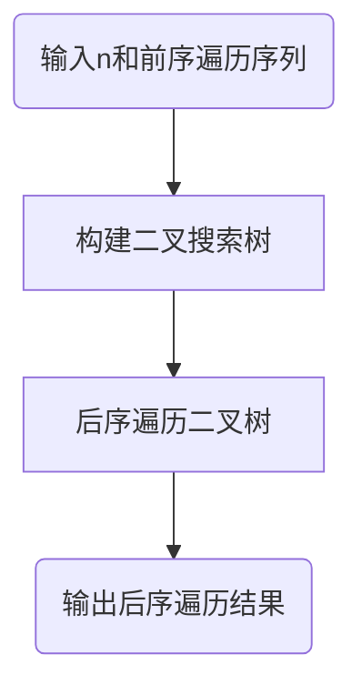
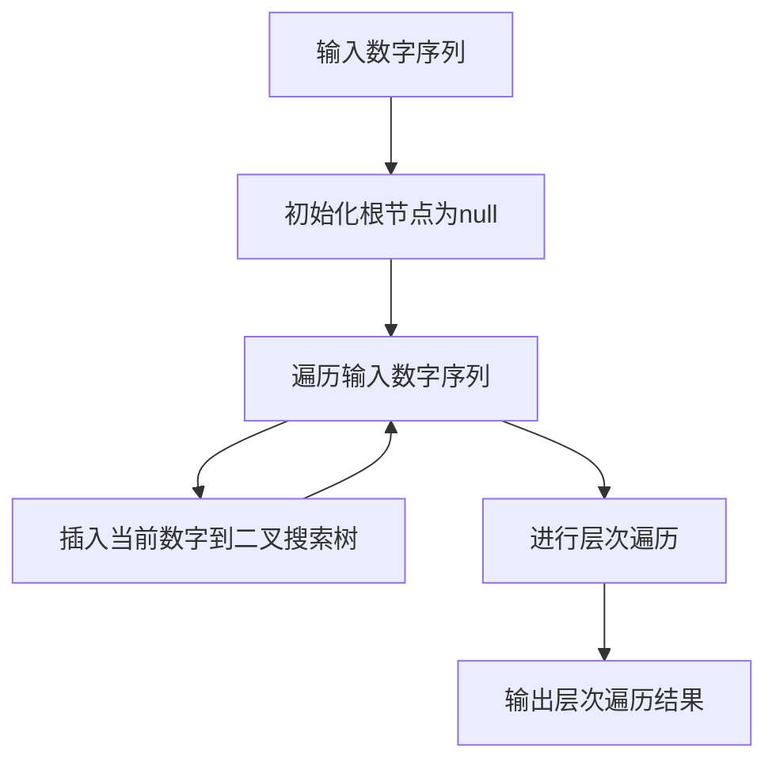
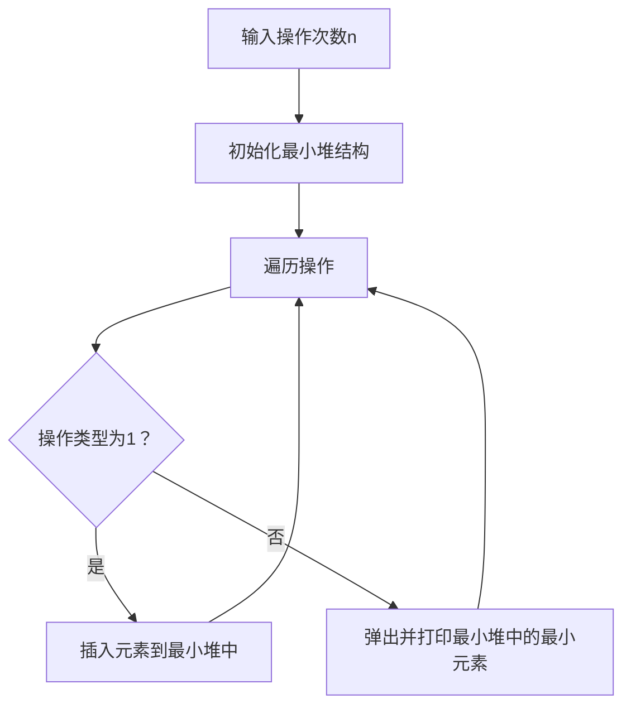

# Assignment #6: "树"算：Huffman,BinHeap,BST,AVL,DisjointSet

Updated 2214 GMT+8 March 24, 2024

2024 spring, Complied by 杨乐山 2100011502


**说明：**

1）这次作业内容不简单，耗时长的话直接参考题解。

2）请把每个题目解题思路（可选），源码Python, 或者C++（已经在Codeforces/Openjudge上AC），截图（包含Accepted），填写到下面作业模版中（推荐使用 typora https://typoraio.cn ，或者用word）。AC 或者没有AC，都请标上每个题目大致花费时间。

3）提交时候先提交pdf文件，再把md或者doc文件上传到右侧“作业评论”。Canvas需要有同学清晰头像、提交文件有pdf、"作业评论"区有上传的md或者doc附件。

4）如果不能在截止前提交作业，请写明原因。


**编程环境**

操作系统：Windows 11 专业版 23H2 22631.3296

Python编程环境：PyCharm 2023.3.5 (Professional Edition)


## 1. 题目

### 22275: 二叉搜索树的遍历

http://cs101.openjudge.cn/practice/22275/


思路：

首先，从输入中获取节点数n和前序遍历序列；

然后，使用前序遍历序列构建二叉搜索树；

接着，对构建好的二叉树进行后序遍历；

最后，输出后序遍历结果。




代码

```python
class TreeNode:
    def __init__(self, val):
        self.val = val
        self.left = None
        self.right = None

def buildBST(preorder):
    if not preorder:
        return None
    root_val = preorder[0]
    root = TreeNode(root_val)
    left_preorder = [x for x in preorder if x < root_val]
    right_preorder = [x for x in preorder if x > root_val]
    root.left = buildBST(left_preorder)
    root.right = buildBST(right_preorder)
    return root

def postorderTraversal(root):
    if not root:
        return []
    return postorderTraversal(root.left) + postorderTraversal(root.right) + [root.val]

if __name__ == "__main__":
    n = int(input())
    preorder = list(map(int, input().split()))
    root = buildBST(preorder)
    result = postorderTraversal(root)
    print(' '.join(map(str, result)))
```


代码运行截图


### 05455: 二叉搜索树的层次遍历

http://cs101.openjudge.cn/practice/05455/


思路：

首先，从输入中获取数字序列；

然后，初始化根节点为null；

接着，遍历输入数字序列；

对于每个数字，将其插入到二叉搜索树中；

完成遍历后，进行层次遍历；

最后，输出层次遍历结果。





代码

```python
class TreeNode:
    def __init__(self, val):
        self.val = val
        self.left = None
        self.right = None

def insert(root, val):
    if not root:
        return TreeNode(val)
    if val < root.val:
        root.left = insert(root.left, val)
    elif val > root.val:
        root.right = insert(root.right, val)
    return root

def levelOrderTraversal(root):
    result = []
    if not root:
        return result
    queue = [root]
    while queue:
        node = queue.pop(0)
        result.append(node.val)
        if node.left:
            queue.append(node.left)
        if node.right:
            queue.append(node.right)
    return result

if __name__ == "__main__":
    nums = list(map(int, input().split()))
    root = None
    for num in nums:
        root = insert(root, num)
    result = levelOrderTraversal(root)
    print(' '.join(map(str, result)))
```


### 04078: 实现堆结构

http://cs101.openjudge.cn/practice/04078/

练习自己写个BinHeap。当然机考时候，如果遇到这样题目，直接import heapq。手搓栈、队列、堆、AVL等，考试前需要搓个遍。


思路：

首先，从输入中获取数字序列；

然后，初始化根节点为null；

接着，遍历输入数字序列；

对于每个数字，将其插入到二叉搜索树中；

完成遍历后，进行层次遍历；

最后，输出层次遍历结果。





代码

```python
import heapq

class MinHeap:
    def __init__(self):
        self.heap = []

    def insert(self, val):
        heapq.heappush(self.heap, val)

    def pop_min(self):
        return heapq.heappop(self.heap)

if __name__ == "__main__":
    n = int(input())
    min_heap = MinHeap()
    for _ in range(n):
        op_type, *args = map(int, input().split())
        if op_type == 1:
            min_heap.insert(args[0])
        elif op_type == 2:
            if min_heap.heap:
                print(min_heap.pop_min())
```


### 22161: 哈夫曼编码树

http://cs101.openjudge.cn/practice/22161/


思路：


代码

```python
# 

```


代码运行截图 ==（AC代码截图，至少包含有"Accepted"）==


### 晴问9.5: 平衡二叉树的建立

https://sunnywhy.com/sfbj/9/5/359


思路：


代码

```python
# 

```


代码运行截图 ==（AC代码截图，至少包含有"Accepted"）==


### 02524: 宗教信仰

http://cs101.openjudge.cn/practice/02524/


思路：


代码

```python
# 

```


代码运行截图 ==（AC代码截图，至少包含有"Accepted"）==


## 2. 学习总结和收获

==如果作业题目简单，有否额外练习题目，比如：OJ“2024spring每日选做”、CF、LeetCode、洛谷等网站题目。==


