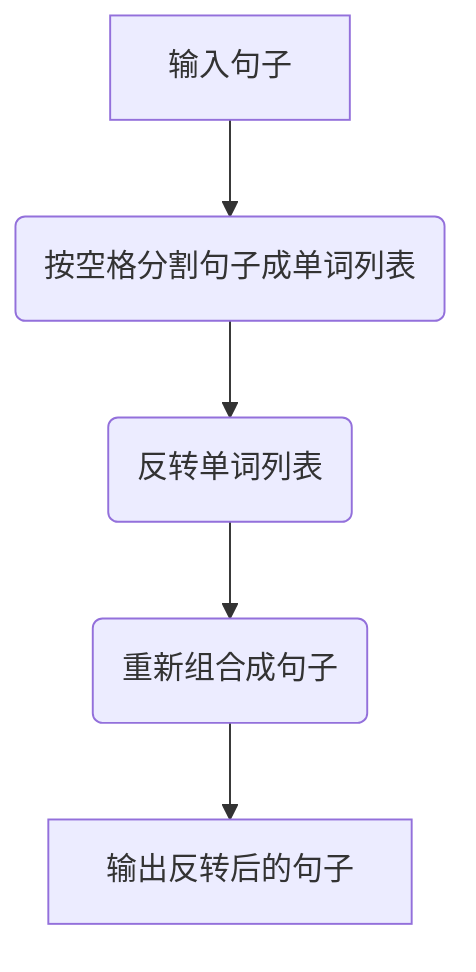
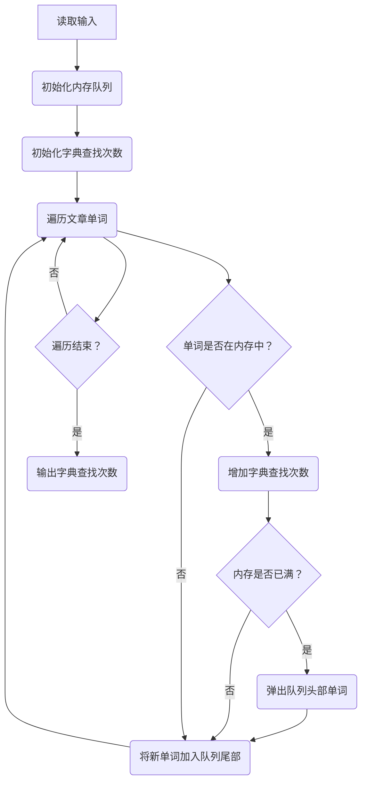
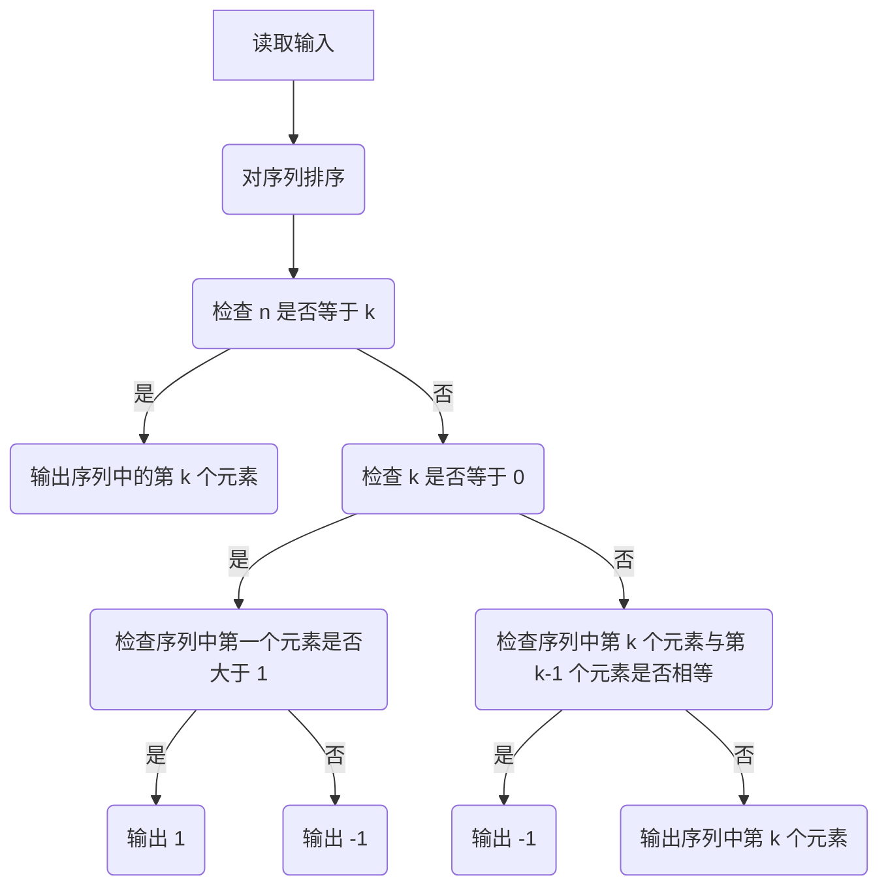
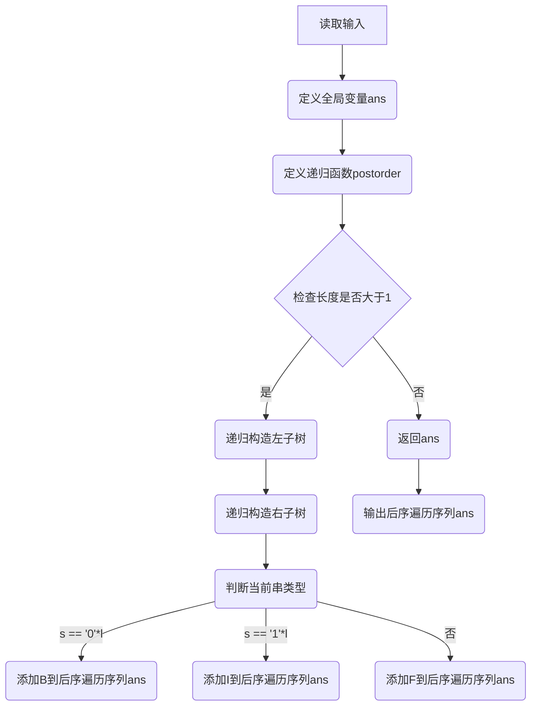
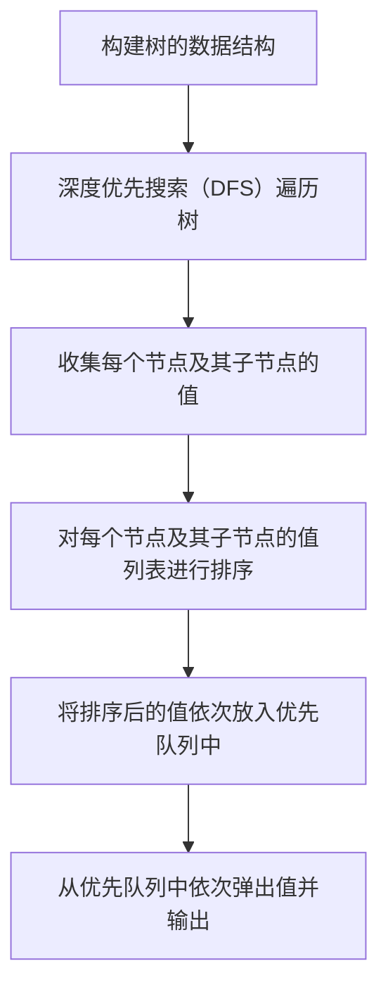

# Assignment #7: April 月考

Updated 1557 GMT+8 Apr 3, 2024

2024 spring, Complied by 杨乐山 2100011502


**说明：**

1）请把每个题目解题思路（可选），源码Python, 或者C++（已经在Codeforces/Openjudge上AC），截图（包含Accepted），填写到下面作业模版中（推荐使用 typora https://typoraio.cn ，或者用word）。AC 或者没有AC，都请标上每个题目大致花费时间。

2）提交时候先提交pdf文件，再把md或者doc文件上传到右侧“作业评论”。Canvas需要有同学清晰头像、提交文件有pdf、"作业评论"区有上传的md或者doc附件。

3）如果不能在截止前提交作业，请写明原因。


**编程环境**

操作系统：Windows 11 专业版 23H2 22631.3296

Python编程环境：PyCharm 2023.3.5 (Professional Edition)


## 1. 题目

### 27706: 逐词倒放

http://cs101.openjudge.cn/practice/27706/


思路：

1. **读取输入：** 从标准输入读取一行句子。
2. **分割句子：** 将句子按空格分割成单词列表。
3. **反转单词列表：** 将单词列表进行反转操作。
4. **重新组合句子：** 将反转后的单词列表重新组合成句子。
5. **输出结果：** 将重新组合的句子输出到标准输出。




代码

```python
def reverse_sentence(sentence):
    words = sentence.split()  # 将句子按空格分割成单词列表
    reversed_words = words[::-1]  # 反转单词列表
    reversed_sentence = ' '.join(reversed_words)  # 将反转后的单词列表重新组合成句子
    return reversed_sentence

# 读取输入
input_sentence = input().strip()

# 调用函数并输出结果
print(reverse_sentence(input_sentence))
```


代码运行截图


### 27951: 机器翻译

http://cs101.openjudge.cn/practice/27951/


思路：

1. **初始化内存和计数器：** 创建一个空队列（模拟内存）和一个计数器（记录字典查找次数）。

2. 遍历文章单词：

    对于文章中的每个单词，依次执行以下操作：

   - 检查单词是否在内存中。
   - 如果单词不在内存中：
     - 增加字典查找次数。
     - 如果内存已满，弹出队列头部的单词。
     - 将新单词加入内存队列的尾部。

3. **输出结果：** 输出字典查找次数。




代码

```python
from collections import deque

def translate(M, N, words):
    memory = deque()
    dictionary_lookups = 0

    for word in words:
        if word not in memory:
            dictionary_lookups += 1
            if len(memory) == M:
                memory.popleft()
            memory.append(word)

    return dictionary_lookups

# 读取输入
M, N = map(int, input().split())
words = list(map(int, input().split()))

# 调用函数并输出结果
print(translate(M, N, words))
```


代码运行截图


### 27932: Less or Equal

http://cs101.openjudge.cn/practice/27932/


思路：

1. 读取输入的整数 n 和 k，以及整数序列 nums。
2. 对 nums 进行排序，以便后续操作。
3. 根据题目中给出的条件进行分类讨论：
   - 如果 n 等于 k，说明序列中所有元素都小于或等于最大值，因此输出序列中的第 k 个元素即可。
   - 如果 k 等于 0，说明要找到第一个大于 1 的元素，如果序列的第一个元素大于 1，则输出 1，否则输出 -1。
   - 如果序列中第 k 个元素与第 k-1 个元素不相等，则输出第 k 个元素。
   - 如果序列中第 k 个元素与第 k-1 个元素相等，则说明有多个相同的元素满足条件，输出 -1。




代码

```python
n , k = list(map(int, input().split()))
 
nums = list(map(int , input().split()))
nums.sort()
if n == k:
    print(nums[k-1])
elif k == 0:
    if nums[0] > 1:
        print(1)
    else:
        print(-1)
elif nums[k] != nums[k-1]:
    print(nums[k-1])
elif nums[k] == nums[k-1]:
    print(-1)
```


代码运行截图


### 27948: FBI树

http://cs101.openjudge.cn/practice/27948/


思路：

1. 读取输入的整数 n 表示二叉树的深度，以及长度为 2^N 的01串 s。
2. 定义一个全局变量 ans，用于存储后序遍历序列。
3. 定义一个递归函数 postorder(s)，该函数用于构造FBI树并生成后序遍历序列。
4. 如果输入的串 s 的长度大于1，则继续递归构造左右子树。
5. 当递归到底层时（长度为1），根据当前串 s 的情况判断是B、I还是F，并将对应的类型添加到后序遍历序列 ans 中。
6. 最后，输出后序遍历序列 ans。




代码

```python
n = int(input())
s = input()
ans =''
def postorder(s):
    global ans
    l = len(s)
    if(l>1):
        postorder(s[:(l//2)])# 左子树
        postorder(s[(l//2):])# 右子树

    if(s == '0'*l):
        ans+='B'
    elif(s == '1'*l):
        ans+='I'
    else:
        ans+='F'
postorder(s)
print(ans)
```


代码运行截图


### 27925: 小组队列

http://cs101.openjudge.cn/practice/27925/


思路：没有思路在原题目网站找到了以下题解，但还是超时了，不知道该怎么办


代码

```python
#include<bits/stdc++.h>
using namespace std;
const int N = 1010,M = 1e6+10;
int tt = -1,hh = 0;
int q[N];

int H[M];
int main(){
    int t;
    int no = 0;
    while(cin>>t,t){
        queue<int> S[t];
        no++;
        printf("Scenario #%d\n",no);
        tt = -1,hh = 0;
        for(int i = 0;i<t;i++) {
            int n;cin>>n;
            for(int j = 0;j<n;j++){
                int x;cin>>x;
                H[x] = i;
            }
        }
        char s[10];
        while(true){
            scanf("%s",&s);
            if(s[0] == 'E') {
                int x;cin>>x;
                int k = H[x];
                if(S[k].size() == 0) q[++tt] = k;
                S[k].push(x);
            }else if(s[0] == 'D'){
                int k = q[hh];
                printf("%d\n",S[k].front());
                S[k].pop();
                if(!S[k].size()) hh++;
            }else break;
        }
        cout<<endl;
    }
    return 0;
}

作者：重生之我是tourist
链接：https://www.acwing.com/solution/content/158592/
来源：AcWing
著作权归作者所有。商业转载请联系作者获得授权，非商业转载请注明出处。
```


代码运行截图


### 27928: 遍历树

http://cs101.openjudge.cn/practice/27928/


思路：

1. 首先，我们需要构建树的数据结构。我们可以使用一个字典来表示每个节点的子节点列表。键为节点值，值为其子节点值列表。
2. 然后，我们进行深度优先搜索（DFS）遍历树。遍历过程中，我们按照规定的顺序收集每个节点及其子节点的值，并存储为一个列表。
3. 接下来，我们对每个节点及其子节点的值列表进行排序。
4. 最后，我们将排序后的值依次放入优先队列中。优先队列会自动按照值的大小进行排序。
5. 最终，我们从优先队列中依次弹出值并输出，即得到了按照题目规则遍历树的结果。




代码

```python
import heapq

class TreeNode:
    def __init__(self, val):
        self.val = val
        self.children = []

def traverse_tree(root):
    # 优先队列，存储节点值
    pq = []
    
    # DFS函数
    def dfs(node):
        nonlocal pq
        # 收集节点及其子节点的值，并存储为列表
        values = [node.val]
        for child in node.children:
            values.extend(dfs(child))
        # 对值列表进行排序
        values.sort()
        # 将排序后的值列表中的值依次放入优先队列中
        for val in values:
            heapq.heappush(pq, val)
        return values
    
    # 开始DFS
    dfs(root)
    
    # 从优先队列中依次弹出值并输出
    while pq:
        print(heapq.heappop(pq))

# 读取输入
n = int(input())  # 节点个数
node_dict = {}  # 用字典存储节点对象
for _ in range(n):
    values = list(map(int, input().split()))
    val = values[0]
    node = TreeNode(val)
    for child_val in values[1:]:
        child = TreeNode(child_val)
        node.children.append(child)
        node_dict[child_val] = child
    node_dict[val] = node

# 找到根节点
root_val = None
for val in node_dict:
    if val not in [child_val for node in node_dict.values() for child_val in node.children]:
        root_val = val
        break
root = node_dict[root_val]

# 遍历树
traverse_tree(root)
```


代码运行截图


## 2. 学习总结和收获

最后两题汗流浃背了🤯


