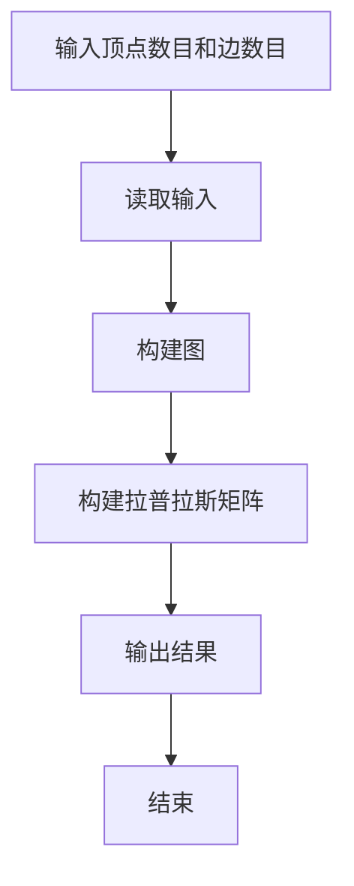
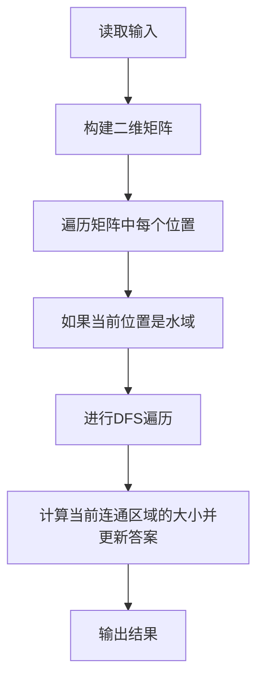
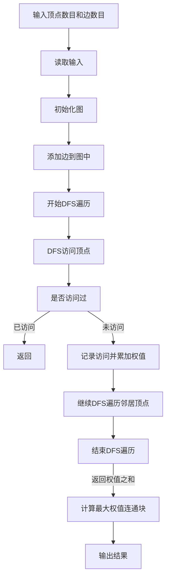
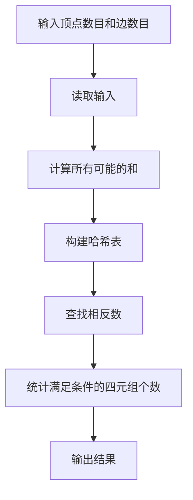
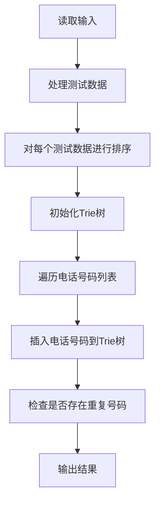
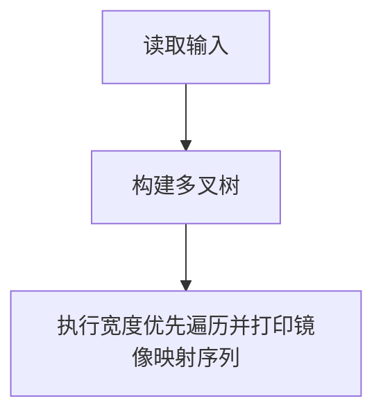

# Assignment #8: 图论：概念、遍历，及 树算

Updated 1919 GMT+8 Apr 8, 2024

2024 spring, Complied by 杨乐山 2100011502


**说明：**

1）请把每个题目解题思路（可选），源码Python, 或者C++（已经在Codeforces/Openjudge上AC），截图（包含Accepted），填写到下面作业模版中（推荐使用 typora https://typoraio.cn ，或者用word）。AC 或者没有AC，都请标上每个题目大致花费时间。

2）提交时候先提交pdf文件，再把md或者doc文件上传到右侧“作业评论”。Canvas需要有同学清晰头像、提交文件有pdf、"作业评论"区有上传的md或者doc附件。

3）如果不能在截止前提交作业，请写明原因。


**编程环境**

操作系统：Windows 11 专业版 23H2 22631.3296

Python编程环境：PyCharm 2023.3.5 (Professional Edition)


## 1. 题目

### 19943: 图的拉普拉斯矩阵

matrices, http://cs101.openjudge.cn/practice/19943/

请定义Vertex类，Graph类，然后实现


思路：

### `Vertex` 类

- `__init__(self, key)`: 初始化顶点对象，其中 `key` 作为顶点的唯一标识符。
- `addNeighbor(self, nbr, weight=0)`: 添加邻居顶点，可以指定权重，默认为0。
- `__str__(self)`: 返回顶点的字符串表示，包括标识符和连接的邻居顶点。
- `getConnections(self)`: 返回连接的邻居顶点。
- `getId(self)`: 返回顶点的标识符。
- `getWeight(self, nbr)`: 返回与指定邻居顶点连接的边的权重。

### `Graph` 类

- `__init__(self)`: 初始化图对象，包括顶点列表和顶点数目。
- `addVertex(self, key)`: 添加顶点到图中。
- `getVertex(self, n)`: 获取指定标识符的顶点。
- `__contains__(self, n)`: 检查图中是否包含指定标识符的顶点。
- `addEdge(self, f, t, weight=0)`: 添加一条从顶点 `f` 到顶点 `t` 的边，可以指定权重，默认为0。
- `getVertices(self)`: 获取图中所有顶点的标识符。
- `__iter__(self)`: 迭代器，用于遍历图中所有顶点。

### `constructLaplacianMatrix` 函数

- 构建拉普拉斯矩阵的函数，接受顶点数目 `n` 和边的列表 `edges` 作为输入。
- 创建一个图对象，并根据输入的边列表添加顶点和边。
- 遍历图中的每个顶点，构建拉普拉斯矩阵的每一行。
- 返回构建好的拉普拉斯矩阵。

### 主程序部分

- 解析输入的顶点数目 `n` 和边数目 `m`。
- 解析每条边的信息，并将其添加到边列表中。
- 调用 `constructLaplacianMatrix` 函数构建拉普拉斯矩阵。
- 输出结果。

### 思路

整体思路是使用邻接表的方式构建图的表示，然后根据邻接表构建拉普拉斯矩阵。拉普拉斯矩阵的构建过程中，根据图的邻接关系确定每个顶点相邻的顶点数量，以及相邻顶点之间的连接关系，然后填充对应的拉普拉斯矩阵元素。




代码

```python
class Vertex:	
    def __init__(self, key):
        self.id = key
        self.connectedTo = {}

    def addNeighbor(self, nbr, weight=0):
        self.connectedTo[nbr] = weight

    def __str__(self):
        return str(self.id) + ' connectedTo: ' + str([x.id for x in self.connectedTo])

    def getConnections(self):
        return self.connectedTo.keys()

    def getId(self):
        return self.id

    def getWeight(self, nbr):
        return self.connectedTo[nbr]

class Graph:
    def __init__(self):
        self.vertList = {}
        self.numVertices = 0

    def addVertex(self, key):
        self.numVertices = self.numVertices + 1
        newVertex = Vertex(key)
        self.vertList[key] = newVertex
        return newVertex

    def getVertex(self, n):
        if n in self.vertList:
            return self.vertList[n]
        else:
            return None

    def __contains__(self, n):
        return n in self.vertList

    def addEdge(self, f, t, weight=0):
        if f not in self.vertList:
            nv = self.addVertex(f)
        if t not in self.vertList:
            nv = self.addVertex(t)
        self.vertList[f].addNeighbor(self.vertList[t], weight)

    def getVertices(self):
        return self.vertList.keys()

    def __iter__(self):
        return iter(self.vertList.values())

def constructLaplacianMatrix(n, edges):
    graph = Graph()
    for i in range(n):	# 添加顶点
        graph.addVertex(i)
    
    for edge in edges:	# 添加边
        a, b = edge
        graph.addEdge(a, b)
        graph.addEdge(b, a)
    
    laplacianMatrix = []	# 构建拉普拉斯矩阵
    for vertex in graph:
        row = [0] * n
        row[vertex.getId()] = len(vertex.getConnections())
        for neighbor in vertex.getConnections():
            row[neighbor.getId()] = -1
        laplacianMatrix.append(row)

    return laplacianMatrix


n, m = map(int, input().split())	# 解析输入
edges = []
for i in range(m):
    a, b = map(int, input().split())
    edges.append((a, b))

laplacianMatrix = constructLaplacianMatrix(n, edges)	# 构建拉普拉斯矩阵

for row in laplacianMatrix:	# 输出结果
    print(' '.join(map(str, row)))
```


代码运行截图


### 18160: 最大连通域面积

matrix/dfs similar, http://cs101.openjudge.cn/practice/18160


思路：

### 全局变量

- `dire`: 方向数组，用于指示DFS的八个方向。
- `area`: 全局变量，用于存储当前连通区域的大小。

### `dfs(x, y)` 函数

- 使用DFS递归地遍历当前位置 `(x, y)` 的连通区域，并计算连通区域的大小。
- 当遇到空地 `'.'` 时返回，结束当前连通区域的遍历。
- 遍历过的位置用 `'.'` 标记，防止重复遍历。

### 主循环

- 读取输入，获取矩阵的行数 `n` 和列数 `m`。
- 根据输入构建二维矩阵 `matrix`，并在边界上添加一圈 `'.'`，以防止索引越界。
- 遍历矩阵中的每个位置 `(i, j)`：
  - 如果当前位置是水域 `'W'`，则进行DFS遍历，计算当前连通区域的大小。
  - 更新答案 `ans` 为当前连通区域的大小和之前答案的较大值。

### 输出结果

- 输出最大连通区域的大小 `ans`。

### 思路

1. 遍历矩阵中的每个位置 `(i, j)`，如果当前位置是水域 `'W'`，则进行DFS遍历，计算当前连通区域的大小。
2. 在DFS遍历过程中，通过记录连通区域的大小，找到最大的连通区域。
3. 输出最大连通区域的大小。




代码：

```python
dire = [[-1,-1],[-1,0],[-1,1],[0,1],[1,1],[1,0],[1,-1],[0,-1]]
area = 0
def dfs(x,y):
    global area
    if matrix[x][y] == '.':
        return
    
    matrix[x][y] = '.'
    area += 1
    for i in range(8):
        dfs(x+dire[i][0], y+dire[i][1])

t = int(input())
for _ in range(t):
    ans = 0
    n ,m = map(int, input().split())
    edge = [['.']*(m+2)]
    matrix = edge + [['.'] + [str(x) for x in input()] + ['.'] for _ in range(n)] + edge
    for i in range(1,n+1):
        for j in range(1,m+1):
            if matrix[i][j] == 'W':
                area = 0
                dfs(i, j)
                ans = max(ans, area)

    print(ans)
```


代码运行截图


### sy383: 最大权值连通块

https://sunnywhy.com/sfbj/10/3/383


思路：

1. 我们首先需要遍历图中的每个顶点，对于每个顶点进行深度优先搜索（DFS）来找到与之连通的所有顶点。
2. 在 DFS 的过程中，我们记录已经访问过的顶点，避免重复访问，同时累加权值。
3. 对于每次 DFS 得到的连通块，计算其顶点权值之和，然后更新最大权值。
4. 最终，输出最大权值。




代码

```python
def dfs(graph, visited, node):
    visited.add(node)
    weight_sum = weights[node]
    for neighbor in graph[node]:
        if neighbor not in visited:
            weight_sum += dfs(graph, visited, neighbor)
    return weight_sum

def max_connected_block(graph, weights):
    max_weight = 0
    visited = set()
    for node in range(len(graph)):
        if node not in visited:
            weight_sum = dfs(graph, visited, node)
            max_weight = max(max_weight, weight_sum)
    return max_weight

# 读取输入
n, m = map(int, input().split())
weights = list(map(int, input().split()))

# 初始化图
graph = {i: [] for i in range(n)}

# 添加边到图中
for _ in range(m):
    u, v = map(int, input().split())
    graph[u].append(v)
    graph[v].append(u)

# 计算最大权值连通块并输出结果
result = max_connected_block(graph, weights)
print(result)
```


代码运行截图


### 03441: 4 Values whose Sum is 0

data structure/binary search, http://cs101.openjudge.cn/practice/03441


思路：

1. 首先，我们需要遍历前两个列表 A 和 B，计算它们所有可能的和，并将这些和以及对应出现的次数存储在一个哈希表中。
2. 然后，我们遍历后两个列表 C 和 D，在哈希表中查找是否存在相反数，如果存在相反数，则表示找到了一组满足条件的四元组。
3. 最后，统计所有满足条件的四元组个数并返回。




代码

```python
def fourSumCount(A, B, C, D):
    sum_count = {}
    for a in A:
        for b in B:
            if a + b not in sum_count:
                sum_count[a + b] = 1
            else:
                sum_count[a + b] += 1
    
    count = 0
    for c in C:
        for d in D:
            if -(c + d) in sum_count:
                count += sum_count[-(c + d)]
    
    return count

# 读取输入
n = int(input())
A, B, C, D = [], [], [], []
for _ in range(n):
    a, b, c, d = map(int, input().split())
    A.append(a)
    B.append(b)
    C.append(c)
    D.append(d)

# 计算满足条件的四元组个数并输出结果
result = fourSumCount(A, B, C, D)
print(result)
```


代码运行截图


### 04089: 电话号码

trie, http://cs101.openjudge.cn/practice/04089/

Trie 数据结构可能需要自学下。


思路：

### `TrieNode` 类

- `__init__(self)`: 初始化 Trie 节点，包括一个空的子节点字典。

### `Trie` 类

- `__init__(self)`: 初始化 Trie 树，包括根节点。
- `insert(self, nums)`: 向 Trie 树中插入一个电话号码。
- `search(self, num)`: 在 Trie 树中搜索一个电话号码。

### 思路

1. 首先定义了 `TrieNode` 类，表示 Trie 树的节点，其中 `child` 属性是一个字典，用于存储子节点。
2. 然后定义了 `Trie` 类，表示 Trie 树的结构，其中包括插入和搜索操作。
3. 对于每个测试数据，首先按照逆序排序电话号码，然后利用 Trie 树来检查电话号码是否一致。
4. 如果插入一个电话号码后 Trie 树中已经存在相同的电话号码，则说明存在重复号码，输出 "NO"；否则输出 "YES"。





代码

```python
class TrieNode:
    def __init__(self):
        self.child={}


class Trie:
    def __init__(self):
        self.root = TrieNode()

    def insert(self, nums):
        curnode = self.root
        for x in nums:
            if x not in curnode.child:
                curnode.child[x] = TrieNode()
            curnode=curnode.child[x]

    def search(self, num):
        curnode = self.root
        for x in num:
            if x not in curnode.child:
                return 0
            curnode = curnode.child[x]
        return 1


t = int(input())
p = []
for _ in range(t):
    n = int(input())
    nums = []
    for _ in range(n):
        nums.append(str(input()))
    nums.sort(reverse=True)
    s = 0
    trie = Trie()
    for num in nums:
        s += trie.search(num)
        trie.insert(num)
    if s > 0:
        print('NO')
    else:
        print('YES')
```


代码运行截图


### 04082: 树的镜面映射

http://cs101.openjudge.cn/practice/04082/


思路：

### `TreeNode` 类

- `__init__(self, x)`: 初始化树节点，包括节点值 `x` 和子节点列表 `children`。

### `create_node()` 函数

- 创建并返回一个空的树节点。

### `build_tree(tempList, index)` 函数

- 递归地构建多叉树，根据输入的列表 `tempList` 和索引 `index` 构建树的节点及其子节点。

### `print_tree(p)` 函数

- 对构建好的多叉树进行宽度优先遍历，并打印镜像映射序列。

### 思路

1. 定义了 `TreeNode` 类来表示树节点，包含节点值 `x` 和子节点列表 `children`。
2. 使用递归方式构建多叉树，根据输入列表和索引构建树的节点及其子节点。
3. 对构建好的多叉树进行宽度优先遍历，先将右子节点逆序入栈，然后出栈入队列，接着遍历左子节点及其右子节点，再将右子节点逆序入栈，直到遍历完整个树。



以上 Mermaid 图展示了代码的执行流程，有助于更好地理解代码的逻辑结构。

代码

```python
from collections import deque

class TreeNode:
    def __init__(self, x):
        self.x = x
        self.children = []

def create_node():
    return TreeNode('')

def build_tree(tempList, index):
    node = create_node()
    node.x = tempList[index][0]
    if tempList[index][1] == '0':
        index += 1
        child, index = build_tree(tempList, index)
        node.children.append(child)
        index += 1
        child, index = build_tree(tempList, index)
        node.children.append(child)
    return node, index

def print_tree(p):
    Q = deque()
    s = deque()

    # 遍历右子节点并将非虚节点加入栈s
    while p is not None:
        if p.x != '$':
            s.append(p)
        p = p.children[1] if len(p.children) > 1 else None

    # 将栈s中的节点逆序放入队列Q
    while s:
        Q.append(s.pop())

    # 宽度优先遍历队列Q并打印节点值
    while Q:
        p = Q.popleft()
        print(p.x, end=' ')

        # 如果节点有左子节点，将左子节点及其右子节点加入栈s
        if p.children:
            p = p.children[0]
            while p is not None:
                if p.x != '$':
                    s.append(p)
                p = p.children[1] if len(p.children) > 1 else None

            # 将栈s中的节点逆序放入队列Q
            while s:
                Q.append(s.pop())


n = int(input())
tempList = input().split()

# 构建多叉树
root, _ = build_tree(tempList, 0)

# 执行宽度优先遍历并打印镜像映射序列
print_tree(root)
```


代码运行截图


## 2. 学习总结和收获

题解实在是棒，在它和gpt的帮助下我能真正的搞懂不会的题目！👍
