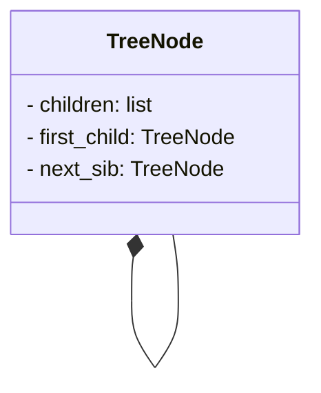
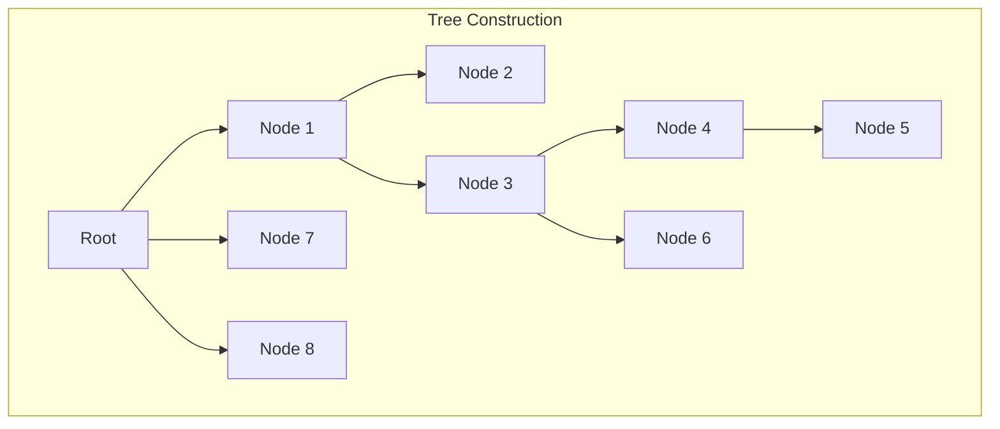
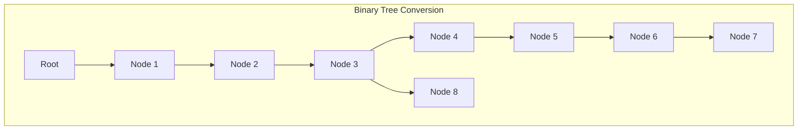
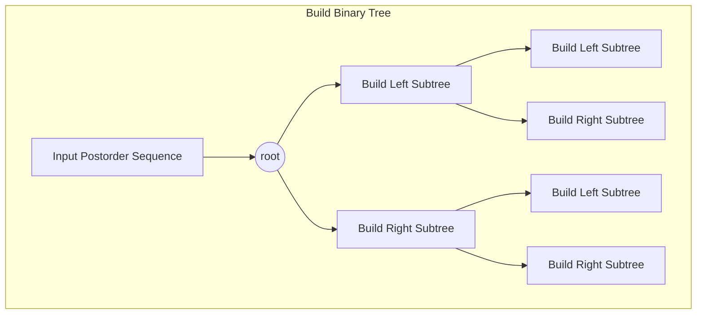
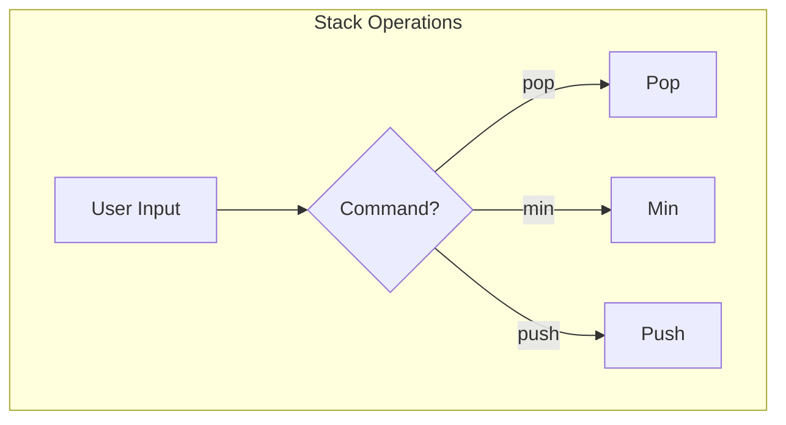
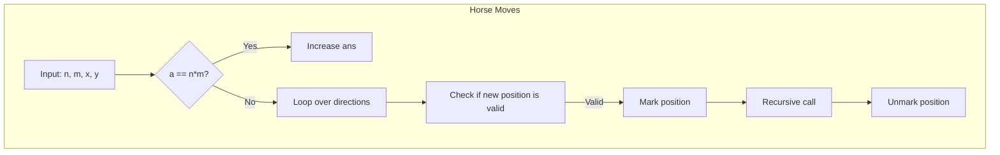
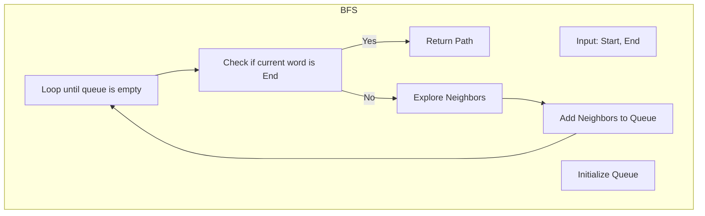

# Assignment #9: 图论：遍历，及 树算

Updated 1739 GMT+8 Apr 14, 2024

2024 spring, Complied by 杨乐山 2100011502


**说明：**

1）请把每个题目解题思路（可选），源码Python, 或者C++（已经在Codeforces/Openjudge上AC），截图（包含Accepted），填写到下面作业模版中（推荐使用 typora https://typoraio.cn ，或者用word）。AC 或者没有AC，都请标上每个题目大致花费时间。

2）提交时候先提交pdf文件，再把md或者doc文件上传到右侧“作业评论”。Canvas需要有同学清晰头像、提交文件有pdf、"作业评论"区有上传的md或者doc附件。

3）如果不能在截止前提交作业，请写明原因。


**编程环境**

操作系统：Windows 11 专业版 23H2 22631.3296

Python编程环境：PyCharm 2023.3.5 (Professional Edition)


## 1. 题目

### 04081: 树的转换

http://cs101.openjudge.cn/dsapre/04081/


思路：

这段代码的主要思路是使用栈模拟深度优先搜索，同时使用左儿子右兄弟的方法将一般的树转换为二叉树。接下来，我将使用 Mermaid 来可视化这个过程。



首先，我们有一个 `TreeNode` 类表示树的节点结构。每个节点有一个 `children` 列表存储子节点，一个 `first_child` 指针指向第一个子节点，以及一个 `next_sib` 指针指向下一个兄弟节点。

接下来，我们可以使用以下代码来表示树的构建过程：



在这个图中，`d` 表示向下走，`u` 表示向上走。从根节点开始，我们根据输入序列逐步构建树结构。

最后，我们使用以下代码来表示树转换为二叉树的过程：



在这个图中，我们通过左儿子右兄弟的方式将一般的树转换为二叉树。每个节点的左孩子指向它的第一个子节点，而右孩子指向它的下一个兄弟节点。


代码

```python
class TreeNode:
    def __init__(self):
        self.children = []
        self.first_child = None
        self.next_sib = None


def build(seq):
    root = TreeNode()
    stack = [root]
    depth = 0
    for act in seq:
        cur_node = stack[-1]
        if act == 'd':
            new_node = TreeNode()
            if not cur_node.children:
                cur_node.first_child = new_node
            else:
                cur_node.children[-1].next_sib = new_node
            cur_node.children.append(new_node)
            stack.append(new_node)
            depth = max(depth, len(stack) - 1)
        else:
            stack.pop()
    return root, depth


def cal_h_bin(node):
    if not node:
         return -1
    return max(cal_h_bin(node.first_child), cal_h_bin(node.next_sib)) + 1


seq = input()
root, h_orig = build(seq)
h_bin = cal_h_bin(root)
print(f'{h_orig} => {h_bin}')
```


代码运行截图


### 08581: 扩展二叉树

http://cs101.openjudge.cn/dsapre/08581/


思路：

1. `BinaryTreeNode` 类定义了二叉树的节点结构，包括节点的值 `value`、左子节点 `left` 和右子节点 `right`。

2. `build_tree` 函数根据给定的后序遍历序列构建二叉树。它使用递归的方式，在每一步中从序列中弹出一个元素，若为`.`表示空节点，则返回 `None`。否则，创建一个节点，并递归构建其左右子树。

3. `inorder` 函数实现了二叉树的中序遍历，返回遍历结果。

4. `postorder` 函数实现了二叉树的后序遍历，返回遍历结果。

5. 主程序中，首先将输入的字符串转换为列表，并反转。然后使用 `build_tree` 函数构建二叉树。接着，分别调用 `inorder` 和 `postorder` 函数得到中序遍历和后序遍历结果，并打印输出。

下面是 Mermaid 流程图，展示了根据后序遍历序列构建二叉树的过程：



在这个图中，从根节点开始，递归地构建左子树和右子树，直到遍历完整个后序遍历序列。


代码

```python
class BinaryTreeNode:
    def __init__(self, value):
        self.value = value
        self.left = None
        self.right = None


def build_tree(lst):
    if not lst:
        return None

    value = lst.pop()
    if value == '.':
        return None

    root = BinaryTreeNode(value)
    root.left = build_tree(lst)
    root.right = build_tree(lst)

    return root


def inorder(root):
    if not root:
        return []

    left = inorder(root.left)
    right = inorder(root.right)
    return left + [root.value] + right


def postorder(root):
    if not root:
        return []

    left = postorder(root.left)
    right = postorder(root.right)
    return left + right + [root.value]


lst = list(input())
root = build_tree(lst[::-1])
in_order_result = inorder(root)
post_order_result = postorder(root)
print(''.join(in_order_result))
print(''.join(post_order_result))
```


代码运行截图 


### 22067: 快速堆猪

http://cs101.openjudge.cn/practice/22067/


思路：

这段代码实现了一个栈数据结构，并能够在常数时间内返回栈中的最小值。

- 使用列表 `a` 作为主栈，用于存储数据。
- 使用列表 `m` 作为辅助栈，用于存储当前栈中的最小值。
- 当用户输入命令时：
  - 如果命令是 "pop"，则从主栈 `a` 中弹出一个元素，并同时从辅助栈 `m` 中也弹出一个元素。
  - 如果命令是 "min"，则打印辅助栈 `m` 中的栈顶元素，即当前栈中的最小值。
  - 否则，将输入的值 `h` 加入主栈 `a` 中，并与辅助栈 `m` 中的栈顶元素进行比较，将较小值压入辅助栈 `m` 中。

整个过程实现了在常数时间内获取栈中的最小值。

下面是 Mermaid 流程图，展示了栈的操作流程：



在这个图中，用户输入被传递给条件判断，根据不同的命令执行相应的操作：弹出元素、返回最小值或压入元素。


代码

```python
a = []
m = []

while True:
    try:
        s = input().split()
    
        if s[0] == "pop":
            if a:
                a.pop()
                if m:
                    m.pop()
        elif s[0] == "min":
            if m:
                print(m[-1])
        else:
            h = int(s[1])
            a.append(h)
            if not m:
                m.append(h)
            else:
                k = m[-1]
                m.append(min(k, h))
    except EOFError:
        break
```


代码运行截图


### 04123: 马走日

dfs, http://cs101.openjudge.cn/practice/04123


思路：

这段代码使用递归来计算在给定的棋盘上马按照日字移动的所有可能方法。

- 定义一个函数 `horse_methods` 来计算所有可能的方法数，它接受当前棋盘的大小 `n` 和 `m`，当前马的位置 `(x, y)`，以及已经走过的点数 `a`（默认为1，表示起始点已经走过）。
- 定义两个列表 `dx` 和 `dy` 分别表示马能够移动的8个方向的横向和纵向偏移量。
- 如果已经走过了所有的点（即 `a == n*m`），则将方法数 `ans` 加1。
- 遍历马能够移动的8个方向，计算新的位置 `(h, l)`。如果新位置在棋盘范围内且未被访问过，则标记为已访问，递归调用 `horse_methods` 函数继续探索。
- 在每次递归调用结束后，要记得取消对当前位置的标记，以便探索其他可能的路径。

下面是 Mermaid 流程图，展示了马按日字移动的可能路径探索过程：



在这个图中，首先判断是否已经走过所有的点，如果是，则增加方法数 `ans`；否则，遍历马能够移动的8个方向，检查新的位置是否在棋盘范围内且未被访问过。对于每个合法的新位置，标记为已访问，递归调用函数继续探索。在递归调用结束后，取消对当前位置的标记，继续探索其他可能的路径。


代码

```python
ans = 0

def horse_methods(n, m, x, y, a=1):
    dx = [-2, -1, 1, 2, 2, 1, -1, -2]
    dy = [1, 2, 2, 1, -1, -2, -2, -1]            #这两行是马跳日字可能的8个方向
    
    if a == n*m:                                 #如果已经所有点都走过了
        global ans                               #声明ans是全局变量，可以一直累加
        ans += 1                                 #方法数+1
    
    for i in range(8):                           #马能走的方向
        h = x + dx[i]
        l = y + dy[i]                            #走过之后马的位置
        if 0 <= h < n and 0 <= l < m:
            if chessboard[h][l] == False:        #如果这个点能走
                chessboard[h][l] = True          #标记，表示走过了
                horse_methods(n, m, h, l, a+1)   #对这个点执行同样的操作
                chessboard[h][l] = False         #沿着该店以后的路径全部完成后，擦去这个点的标记

for _ in range(int(input())):
    n,m,x,y = map(int, input().split())
    chessboard = [[False]*m for _ in range(n)]   #生成棋盘
    chessboard[x][y] = True                      #不要忘记将起始点标记
    ans = 0
    horse_methods(n, m, x, y)
    print(ans)
```


代码运行截图


### 28046: 词梯

bfs, http://cs101.openjudge.cn/practice/28046/


思路：

这段代码实现了一个基于广度优先搜索（BFS）的单词变换问题，也被称为单词接龙问题。下面是代码的主要思路：

1. `construct_graph` 函数用于构建单词图，将具有相同模式（即相同字符位置用 * 代替）的单词归为一类，构建起单词之间的连接关系。它遍历输入的单词列表，对于每个单词，将每个字符替换为 *，生成模式，并将该模式作为键，该单词作为值添加到字典中。这样，对于任意两个具有相同模式的单词，它们在图中是相邻的。

2. `bfs` 函数实现了广度优先搜索算法，用于在构建的图中搜索从起始单词到结束单词的最短路径。它使用一个双端队列 `queue`，每次从队首取出一个单词及其路径，并遍历该单词的所有相邻单词。如果相邻单词等于目标单词，则返回路径；否则，将相邻单词加入队列，并继续搜索。这样，当找到最短路径时，即可返回结果。

3. `word_ladder` 函数是入口函数，它首先构建单词图，然后调用 `bfs` 函数进行搜索。如果搜索到了路径，则返回该路径；否则返回 None。

4. 主程序部分，首先读取输入的单词列表和起始、结束单词，然后调用 `word_ladder` 函数进行处理。最后，如果找到了路径，则打印路径；否则打印 "NO"。

下面是 Mermaid 流程图，展示了广度优先搜索的过程：



在这个图中，首先构建单词图，然后初始化队列并进行循环。在每次循环中，检查当前单词是否为目标单词，如果是则返回路径，否则继续探索相邻单词并加入队列。通过这个 Mermaid 流程图和基本思路，我们可以更好地理解代码的运行过程。


代码

```python
from collections import deque

def construct_graph(words):
    graph = {}
    for word in words:
        for i in range(len(word)):
            pattern = word[:i] + '*' + word[i + 1:]
            if pattern not in graph:
                graph[pattern] = []
            graph[pattern].append(word)
    return graph

def bfs(start, end, graph):
    queue = deque([(start, [start])])
    visited = set([start])
    
    while queue:
        word, path = queue.popleft()
        if word == end:
            return path
        for i in range(len(word)):
            pattern = word[:i] + '*' + word[i + 1:]
            if pattern in graph:
                neighbors = graph[pattern]
                for neighbor in neighbors:
                    if neighbor not in visited:
                        visited.add(neighbor)
                        queue.append((neighbor, path + [neighbor]))
    return None

def word_ladder(words, start, end):
    graph = construct_graph(words)
    return bfs(start, end, graph)

n = int(input())
words = [input().strip() for _ in range(n)]
start, end = input().strip().split()

result = word_ladder(words, start, end)

if result:
    print(' '.join(result))
else:
    print("NO")
```


代码运行截图


### 28050: 骑士周游

dfs, http://cs101.openjudge.cn/practice/28050/


思路：本题和马走日较为类似。

这段代码实现了解决骑士周游问题的算法，主要分为以下几个部分：

1. **图的构建：** 使用 `Graph` 类构建了表示骑士周游问题的图。每个顶点表示棋盘上的一个位置，边表示骑士可以从一个位置到达另一个位置。图中的边通过 `add_edge` 方法添加，其中利用 `gen_legal_moves` 函数生成骑士下一步可能的位置。

2. **骑士周游算法：** 使用 `knight_tour` 函数实现了骑士周游的递归回溯算法。该算法尝试从起始位置出发，按照一定的规则进行深度优先搜索，直到完成一次周游或者搜索失败。

3. **辅助函数：** 提供了一些辅助函数，如 `pos_to_node_id` 将棋盘上的行列坐标转换为顶点 ID，`ordered_by_avail` 按照顶点周围的可用相邻顶点数量排序。

4. **主函数：** `main` 函数读取输入，构建图并调用骑士周游算法进行求解。最后输出结果。


代码

```python
import sys

class Graph:
    def __init__(self):
        self.vertices = {}
        self.num_vertices = 0

    def add_vertex(self, key):
        self.num_vertices = self.num_vertices + 1
        new_ertex = Vertex(key)
        self.vertices[key] = new_ertex
        return new_ertex

    def get_vertex(self, n):
        if n in self.vertices:
            return self.vertices[n]
        else:
            return None

    def __len__(self):
        return self.num_vertices

    def __contains__(self, n):
        return n in self.vertices

    def add_edge(self, f, t, cost=0):
        if f not in self.vertices:
            nv = self.add_vertex(f)
        if t not in self.vertices:
            nv = self.add_vertex(t)
        self.vertices[f].add_neighbor(self.vertices[t], cost)
        #self.vertices[t].add_neighbor(self.vertices[f], cost)

    def getVertices(self):
        return list(self.vertices.keys())

    def __iter__(self):
        return iter(self.vertices.values())


class Vertex:
    def __init__(self, num):
        self.key = num
        self.connectedTo = {}
        self.color = 'white'
        self.distance = sys.maxsize
        self.previous = None
        self.disc = 0
        self.fin = 0

    def __lt__(self,o):
        return self.key < o.key

    def add_neighbor(self, nbr, weight=0):
        self.connectedTo[nbr] = weight

    def get_neighbors(self):
        return self.connectedTo.keys()

    # def getWeight(self, nbr):
    #     return self.connectedTo[nbr]

    def __str__(self):
        return str(self.key) + ":color " + self.color + ":disc " + str(self.disc) + ":fin " + str(
            self.fin) + ":dist " + str(self.distance) + ":pred \n\t[" + str(self.previous) + "]\n"


def knight_graph(board_size):
    kt_graph = Graph()
    for row in range(board_size):           #遍历每一行
        for col in range(board_size):       #遍历行上的每一个格子
            node_id = pos_to_node_id(row, col, board_size) #把行、列号转为格子ID
            new_positions = gen_legal_moves(row, col, board_size) #按照 马走日，返回下一步可能位置
            for row2, col2 in new_positions:
                other_node_id = pos_to_node_id(row2, col2, board_size) #下一步的格子ID
                kt_graph.add_edge(node_id, other_node_id) #在骑士周游图中为两个格子加一条边
    return kt_graph

def pos_to_node_id(x, y, bdSize):
    return x * bdSize + y

def gen_legal_moves(row, col, board_size):
    new_moves = []
    move_offsets = [                        # 马走日的8种走法
        (-1, -2),  # left-down-down
        (-1, 2),  # left-up-up
        (-2, -1),  # left-left-down
        (-2, 1),  # left-left-up
        (1, -2),  # right-down-down
        (1, 2),  # right-up-up
        (2, -1),  # right-right-down
        (2, 1),  # right-right-up
    ]
    for r_off, c_off in move_offsets:
        if (                                # #检查，不能走出棋盘
            0 <= row + r_off < board_size
            and 0 <= col + c_off < board_size
        ):
            new_moves.append((row + r_off, col + c_off))
    return new_moves


def knight_tour(n, path, u, limit):
    u.color = "gray"
    path.append(u)              #当前顶点涂色并加入路径
    if n < limit:
        neighbors = ordered_by_avail(u) #对所有的合法移动依次深入
        #neighbors = sorted(list(u.get_neighbors()))
        i = 0

        for nbr in neighbors:
            if nbr.color == "white" and \
                knight_tour(n + 1, path, nbr, limit):   #选择“白色”未经深入的点，层次加一，递归深入
                return True
        else:                       #所有的“下一步”都试了走不通
            path.pop()              #回溯，从路径中删除当前顶点
            u.color = "white"       #当前顶点改回白色
            return False
    else:
        return True

def ordered_by_avail(n):
    res_list = []
    for v in n.get_neighbors():
        if v.color == "white":
            c = 0
            for w in v.get_neighbors():
                if w.color == "white":
                    c += 1
            res_list.append((c,v))
    res_list.sort(key = lambda x: x[0])
    return [y[1] for y in res_list]


def main():
    def NodeToPos(id):
       return ((id//8, id%8))

    bdSize = int(input())  # 棋盘大小
    *start_pos, = map(int, input().split())  # 起始位置
    g = knight_graph(bdSize)
    start_vertex = g.get_vertex(pos_to_node_id(start_pos[0], start_pos[1], bdSize))
    if start_vertex is None:
        print("fail")
        exit(0)

    tour_path = []
    done = knight_tour(0, tour_path, start_vertex, bdSize * bdSize-1)
    if done:
        print("success")
    else:
        print("fail")

    exit(0)

    # 打印路径
    cnt = 0
    for vertex in tour_path:
        cnt += 1
        if cnt % bdSize == 0:
            print()
        else:
            print(vertex.key, end=" ")
            #print(NodeToPos(vertex.key), end=" ")   # 打印坐标

if __name__ == '__main__':
    main()
```


代码运行截图


## 2. 学习总结和收获

题解真的棒~


