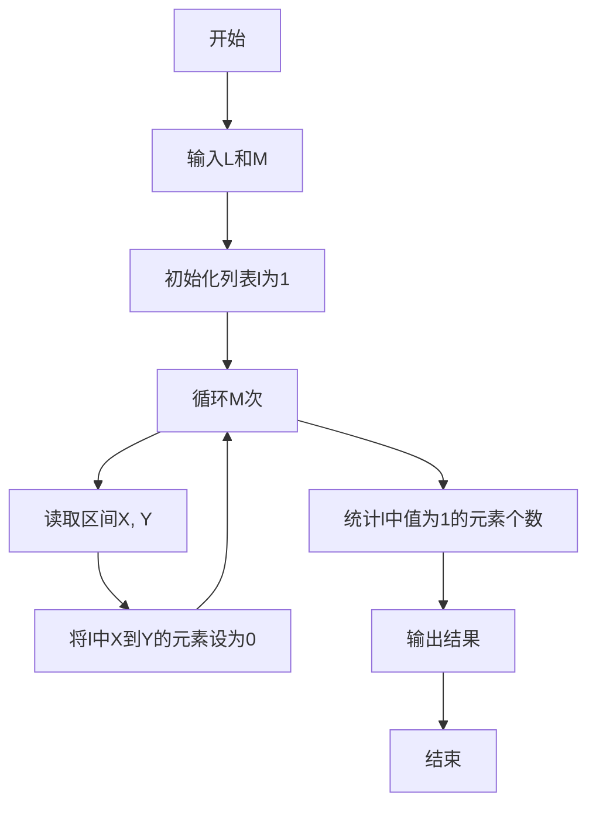
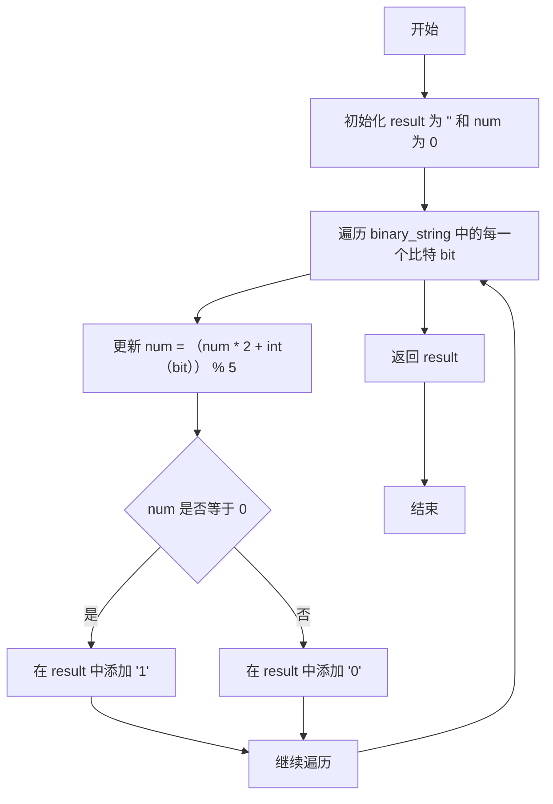
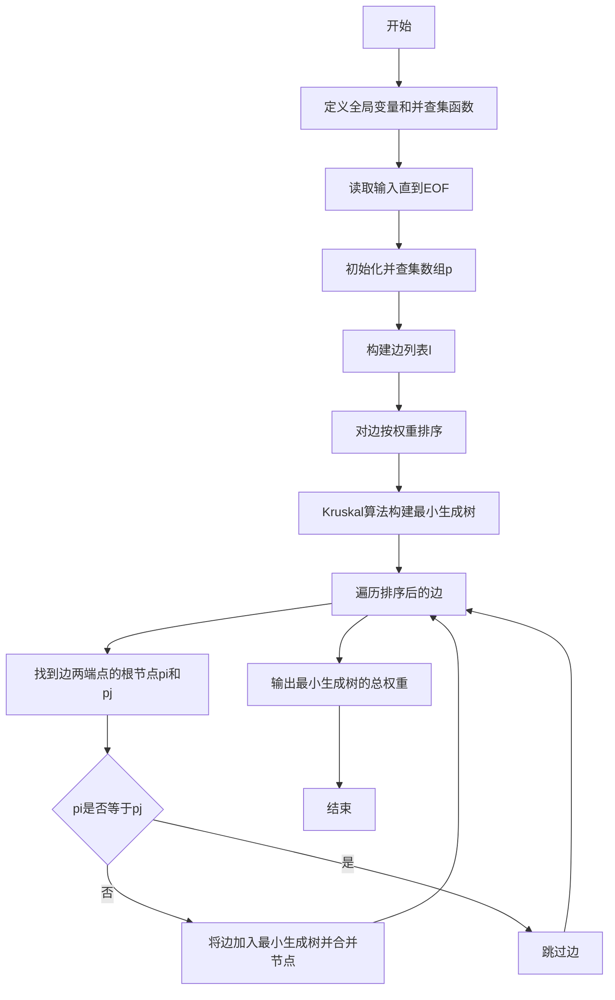
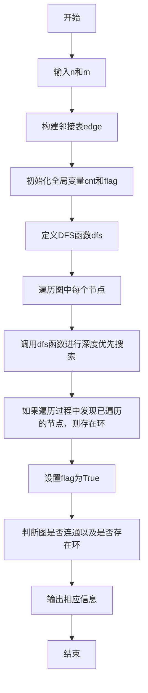
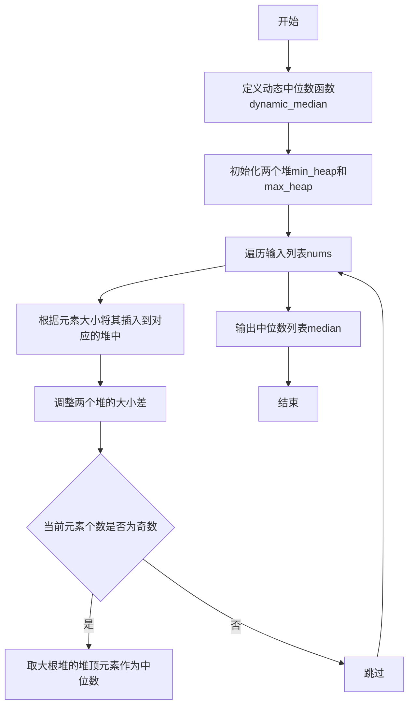
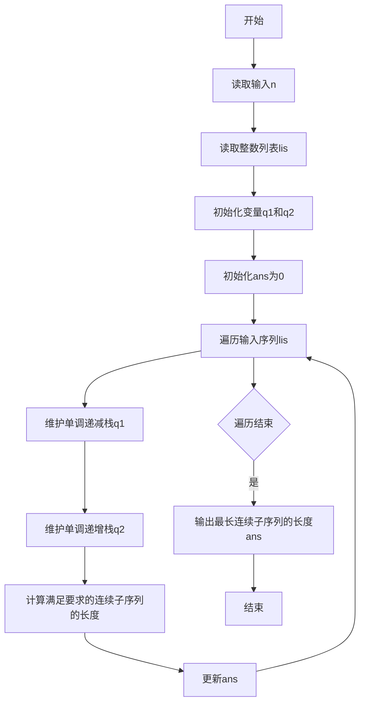

# Assignment #D: May月考

Updated 1654 GMT+8 May 8, 2024

2024 spring, Complied by 杨乐山 2100011502


**说明：**

1）请把每个题目解题思路（可选），源码Python, 或者C++（已经在Codeforces/Openjudge上AC），截图（包含Accepted），填写到下面作业模版中（推荐使用 typora https://typoraio.cn ，或者用word）。AC 或者没有AC，都请标上每个题目大致花费时间。

2）提交时候先提交pdf文件，再把md或者doc文件上传到右侧“作业评论”。Canvas需要有同学清晰头像、提交文件有pdf、"作业评论"区有上传的md或者doc附件。

3）如果不能在截止前提交作业，请写明原因。


**编程环境**

操作系统：Windows 11 专业版 23H2 22631.3296

Python编程环境：PyCharm 2023.3.5 (Professional Edition)


## 1. 题目

### 02808: 校门外的树

http://cs101.openjudge.cn/practice/02808/


思路：

1. **输入两个整数 L 和 M**：L 表示某个范围的长度，M 表示有 M 个区间。

2. **初始化列表**：创建一个长度为 L+1 的列表 `l`，初始值全部为 1。这个列表用于表示某个范围内的位置是否被覆盖。

3. **读取 M 个区间**：对于每个区间 `(X, Y)`，将区间内的所有位置在列表 `l` 中标记为 0，表示这些位置被覆盖。

4. **统计未被覆盖的位置**：遍历列表 `l`，统计值为 1 的位置数量，并输出。




代码

```python
L, M = map(int, input().split())
l = [1]*(L+1)
for i in range(M):
    X, Y = map(int, input().split())
    for j in range(X, Y+1):
        l[j] = 0
print(l.count(1))
```


代码运行截图 


### 20449: 是否被5整除

http://cs101.openjudge.cn/practice/20449/


思路：

1. **函数定义和变量初始化**：
   - 定义 `binary_divisible_by_five` 函数，接收一个二进制字符串 `binary_string`。
   - 初始化一个空字符串 `result`，用于存储结果。
   - 初始化一个整数 `num`，用于累积计算二进制前缀的十进制值。

2. **遍历二进制字符串**：
   - 对于二进制字符串中的每一个比特 `bit`，执行以下操作：
     - 更新 `num` 的值：`num = (num * 2 + int(bit)) % 5`。这一步的目的是根据当前的比特更新 `num` 的值，同时只保留其对 5 的余数，以避免数值过大。
     - 检查 `num` 是否能被 5 整除。如果 `num` 等于 0，则在 `result` 中添加 '1'；否则，添加 '0'。

3. **返回结果**：
   - 返回结果字符串 `result`。



代码

```python
def binary_divisible_by_five(binary_string):
    result = ''
    num = 0
    for bit in binary_string:
        num = (num * 2 + int(bit)) % 5
        if num == 0:
            result += '1'
        else:
            result += '0'
    return result

binary_string = input().strip()
print(binary_divisible_by_five(binary_string))
```


代码运行截图


### 01258: Agri-Net

http://cs101.openjudge.cn/practice/01258/


思路：

1. **全局变量和并查集函数**：
   - `p` 是并查集数组，用于记录每个节点的根节点。
   - `P(x)` 函数用于找到 `x` 的根节点，并进行路径压缩。

2. **输入处理和初始化**：
   - 不断读取输入直到 EOF。每次输入代表一个 `n x n` 的矩阵，表示 `n` 个节点之间的边权重。

3. **构建初始并查集和边列表**：
   - 初始化并查集数组 `p`，每个节点的根节点初始化为它自己。
   - 构建边列表 `l`，只包括 `i` 和 `j` 不相等的节点对及其对应的权重。

4. **边排序**：
   - 对所有边按权重从小到大排序。

5. **Kruskal 算法构建最小生成树**：
   - 遍历排序后的边列表，对于每条边 `(i, j, k)`，找到其两个端点的根节点 `pi` 和 `pj`。
   - 如果两个端点的根节点不同，则将这条边加入最小生成树，并合并两个节点。

6. **输出结果**：
   - 输出构建的最小生成树的总权重 `ans`。



代码

```python
p = []


def P(x):
    if p[x] != x:
        p[x] = P(p[x])
    return p[x]


while True:
    try:
        n = int(input())
    except EOFError:
        break
    ans = 0
    M = [list(map(int, input().split())) for _ in range(n)]
    p = [i for i in range(n)]
    l = []
    for i in range(n):
        for j in range(n):
            if i != j:
                l.append((i, j, M[i][j]))
    l.sort(key=lambda x: x[2])
    for i, j, k in l:
        pi, pj = P(i), P(j)
        if pi != pj:
            p[pi] = pj
            ans += k
    print(ans)
```


代码运行截图


### 27635: 判断无向图是否连通有无回路(同23163)

http://cs101.openjudge.cn/practice/27635/


思路：

1. **输入处理**：
   - 通过 `input()` 函数读取两个整数 `n` 和 `m`，表示图中有 `n` 个节点和 `m` 条边。

2. **构建邻接表**：
   - 创建一个空列表 `edge`，其中 `edge[i]` 表示节点 `i` 的邻居节点列表。
   - 使用 `for` 循环读取 `m` 条边的信息，并将节点之间的边关系存储在邻接表中。

3. **全局变量初始化**：
   - 初始化一个集合 `cnt`，用于记录已经遍历过的节点。
   - 初始化一个布尔变量 `flag`，用于标记是否存在环。

4. **DFS 函数定义**：
   - 定义了一个名为 `dfs` 的递归函数，用于进行深度优先搜索。
   - 在每次递归中，将当前节点加入 `cnt` 集合中，并遍历当前节点的所有相邻节点。
   - 如果遇到已经在 `cnt` 中的节点，并且这个节点不是当前节点的父节点，则说明存在环，将 `flag` 设置为 `True`。

5. **DFS 遍历**：
   - 对于图中的每个节点，调用 `dfs` 函数进行遍历。
   - 在遍历过程中，如果发现已经遍历过的节点，说明存在环，将 `flag` 设置为 `True`。

6. **输出结果**：
   - 根据遍历的结果，判断图是否连通以及是否存在环，并打印相应的信息。

### 思路

- 首先，构建图的邻接表表示，便于进行深度优先搜索。
- 然后，使用深度优先搜索遍历图中的每个节点，检查是否存在环。
- 最后，根据遍历结果判断图是否连通以及是否存在环，并输出相应的信息。




代码

```python
n, m = list(map(int, input().split()))
edge = [[]for _ in range(n)]
for _ in range(m):
    a, b = list(map(int, input().split()))
    edge[a].append(b)
    edge[b].append(a)
cnt, flag = set(), False


def dfs(x, y):
    global cnt, flag
    cnt.add(x)
    for i in edge[x]:
        if i not in cnt:
            dfs(i, x)
        elif y != i:
            flag = True


for i in range(n):
    cnt.clear()
    dfs(i, -1)
    if len(cnt) == n:
        break
    if flag:
        break

print("connected:"+("yes" if len(cnt) == n else "no"))
print("loop:"+("yes" if flag else 'no'))
```


代码运行截图


### 27947: 动态中位数

http://cs101.openjudge.cn/practice/27947/


思路：

1. **导入模块**：
   - 使用了 `heapq` 模块来实现堆结构。

2. **定义动态中位数函数**：
   - `dynamic_median(nums)` 函数接收一个整数列表 `nums`，并返回一个列表，其中每个元素代表插入当前元素后的中位数。

3. **初始化堆**：
   - 创建两个堆，一个最小堆 `min_heap` 用于存储较大的一半元素，一个最大堆 `max_heap` 用于存储较小的一半元素。

4. **遍历输入列表**：
   - 对于输入的每个元素，根据其大小将其插入到对应的堆中。
   - 调整两个堆的大小差，使其不超过 1。

5. **计算中位数**：
   - 如果当前处理的元素个数为奇数，则中位数为大根堆的堆顶元素。

6. **输出结果**：
   - 输出插入每个元素后的中位数。

### 思路

- 使用两个堆（一个最小堆和一个最大堆）来维护中位数。
- 小根堆存储较大的一半元素，大根堆存储较小的一半元素，且大根堆的顶部元素即为中位数。



代码

```python
import heapq

def dynamic_median(nums):
    # 维护小根和大根堆（对顶），保持中位数在大根堆的顶部
    min_heap = []  # 存储较大的一半元素，使用最小堆
    max_heap = []  # 存储较小的一半元素，使用最大堆

    median = []
    for i, num in enumerate(nums):
        # 根据当前元素的大小将其插入到对应的堆中
        if not max_heap or num <= -max_heap[0]:
            heapq.heappush(max_heap, -num)
        else:
            heapq.heappush(min_heap, num)

        # 调整两个堆的大小差，使其不超过 1
        if len(max_heap) - len(min_heap) > 1:
            heapq.heappush(min_heap, -heapq.heappop(max_heap))
        elif len(min_heap) > len(max_heap):
            heapq.heappush(max_heap, -heapq.heappop(min_heap))

        if i % 2 == 0:
            median.append(-max_heap[0])

    return median

T = int(input())
for _ in range(T):
    #M = int(input())
    nums = list(map(int, input().split()))
    median = dynamic_median(nums)
    print(len(median))
    print(*median)
```


代码运行截图


### 28190: 奶牛排队

http://cs101.openjudge.cn/practice/28190/


思路：

1. **导入模块**：
   - 使用了 `bisect_right` 函数来查找在有序列表中插入某个值的位置。

2. **读取输入**：
   - 首先读取一个整数 `n`，表示输入序列的长度。
   - 然后读取一个整数列表 `lis`，表示输入的序列。

3. **初始化变量**：
   - `q1` 和 `q2` 分别是两个单调递减的栈，用于维护子序列的最大值和最小值。
   - `ans` 初始化为 0，用于记录最长连续子序列的长度。

4. **遍历输入序列**：
   - 对于输入序列中的每个元素，执行以下操作：
     - 在 `q1` 中保持单调递减的序列，同时找到满足要求的连续子序列的右边界。
     - 在 `q2` 中保持单调递增的序列，同时找到满足要求的连续子序列的左边界。
     - 计算满足要求的连续子序列的长度，并更新 `ans`。

5. **输出结果**：
   - 输出计算得到的最长连续子序列的长度。

### 思路

- 使用两个栈 `q1` 和 `q2` 分别维护单调递减和单调递增的序列，这样可以保证 `q1[-1]` 为当前子序列的最大值，`q2[-1]` 为当前子序列的最小值。
- 在遍历过程中，通过不断调整两个栈的元素，找到满足要求的连续子序列的左右边界，并计算其长度。
- 不断更新 `ans`，最终得到最长连续子序列的长度。



代码

```python
from bisect import bisect_right as bl
lis,q1,q2,ans=[int(input())for _ in range(int(input()))],[-1],[-1],0
for i in range(len(lis)):
    while len(q1)>1 and lis[q1[-1]]>=lis[i]:q1.pop()
    while len(q2)>1 and lis[q2[-1]]<lis[i]:q2.pop()
    id=bl(q1,q2[-1])
    if id<len(q1):ans=max(ans,i-q1[id]+1)
    q1.append(i)
    q2.append(i)
print(ans)
```


代码运行截图


## 2. 学习总结和收获

快到期末了，很好的题目可以帮助我复习！


