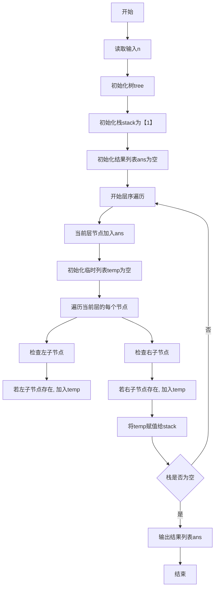
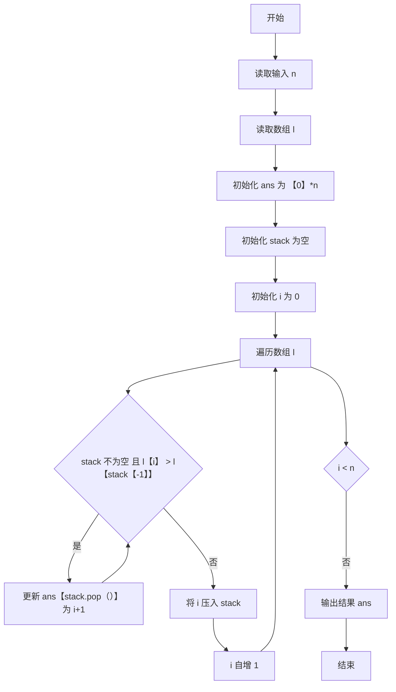
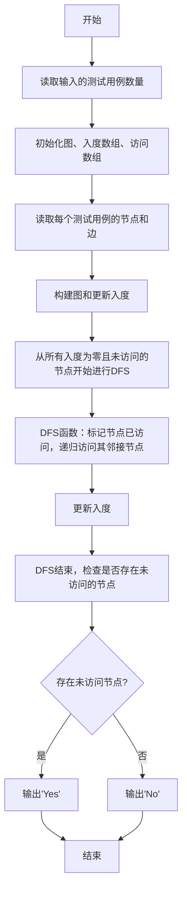
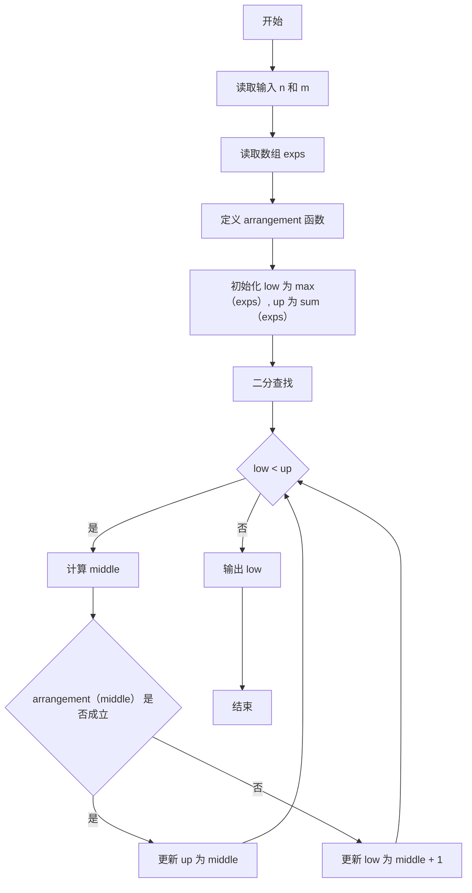
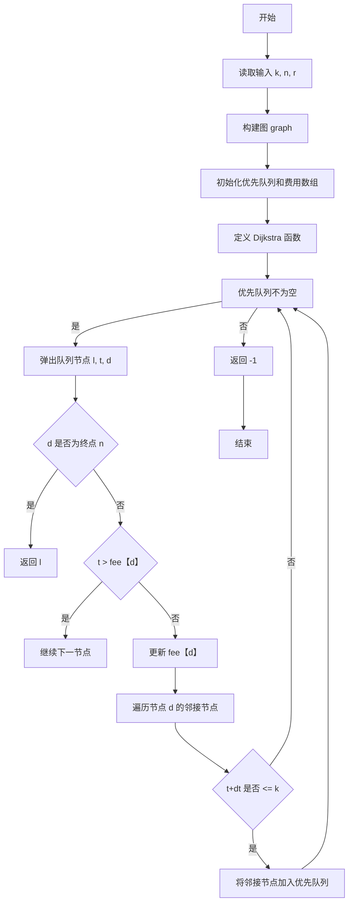
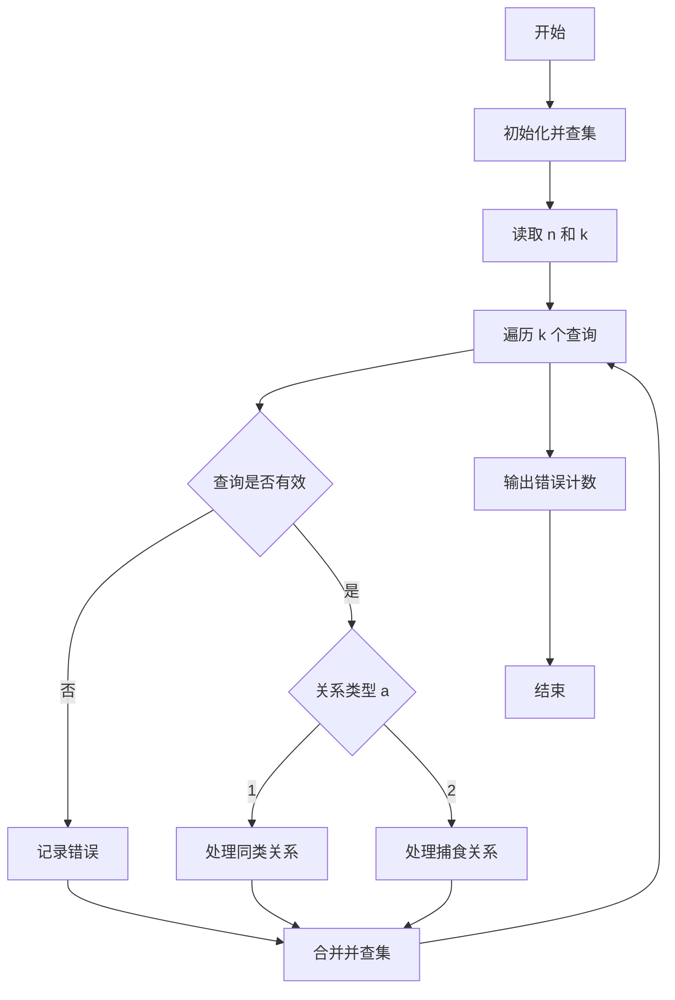

# Assignment #F: All-Killed 满分

Updated 1844 GMT+8 May 20, 2024

2024 spring, Complied by 杨乐山 2100011502


**说明：**

1）请把每个题目解题思路（可选），源码Python, 或者C++（已经在Codeforces/Openjudge上AC），截图（包含Accepted），填写到下面作业模版中（推荐使用 typora https://typoraio.cn ，或者用word）。AC 或者没有AC，都请标上每个题目大致花费时间。

2）提交时候先提交pdf文件，再把md或者doc文件上传到右侧“作业评论”。Canvas需要有同学清晰头像、提交文件有pdf、"作业评论"区有上传的md或者doc附件。

3）如果不能在截止前提交作业，请写明原因。


**编程环境**

操作系统：Windows 11 专业版 23H2 22631.3296

Python编程环境：PyCharm 2023.3.5 (Professional Edition)


## 1. 题目

### 22485: 升空的焰火，从侧面看

http://cs101.openjudge.cn/practice/22485/


思路：

1. **读取输入**：
   - 首先读取一个整数 `n`，表示树的节点数量。
   - 然后读取每个节点的子节点信息，并存储在 `tree` 列表中。`tree[i]` 存储节点 `i` 的左右子节点，若子节点不存在，则存储 `-1`。

2. **初始化变量**：
   - `stack` 初始化为 `[1]`，表示从根节点（节点 1）开始遍历。
   - `ans` 初始化为空列表，用于存储遍历的结果。

3. **层序遍历**：
   - 使用 `stack` 进行层序遍历。在每一层中，遍历当前 `stack` 中的节点，将其子节点加入到 `temp` 列表中。
   - 将 `temp` 列表赋值给 `stack`，用于下一层的遍历。
   - 将当前层的节点加入到 `ans` 列表中。

4. **输出结果**：
   - 将 `ans` 列表中的节点按顺序输出，节点之间用空格分隔。

### 思路

- 使用一个栈（列表）来存储当前层的节点。
- 在遍历每一层时，将当前层的节点的子节点加入到临时列表中，然后将临时列表赋值给栈，进行下一层的遍历。
- 将每一层的节点加入到结果列表中，最终输出结果列表。



代码

```python
n = int(input())
tree = [0]
for i in range(n):
    tree.append(list(map(int, input().split())))
stack = [1]
ans = []
while stack:
    ans.append(str(stack[-1]))
    temp = []
    for x in stack:
        if tree[x][0] != -1:
            temp.append(tree[x][0])
        if tree[x][1] != -1:
            temp.append(tree[x][1])
    stack = temp
print(" ".join(ans))
```


代码运行截图


### 28203:【模板】单调栈

http://cs101.openjudge.cn/practice/28203/


思路：

1. **读取输入**：
   - 首先读取一个整数 `n`，表示数组的长度。
   - 然后读取一个长度为 `n` 的整数列表 `l`。

2. **初始化变量**：
   - `ans` 列表初始化为 `[0] * n`，用于存储结果。
   - `stack` 列表初始化为空，用于存储数组元素的索引。
   - `i` 初始化为 `0`，用于遍历数组。

3. **单调栈处理**：
   - 使用 `while` 循环遍历数组。
   - 对于每个元素 `l[i]`，如果当前栈不为空且栈顶元素对应的值小于 `l[i]`，则弹出栈顶元素，并将其对应的 `ans` 位置更新为 `i + 1`。
   - 将当前元素的索引 `i` 压入栈中。
   - `i` 自增1，继续遍历。

4. **输出结果**：
   - 最后将 `ans` 列表中的结果打印出来。

### 思路

- 使用单调栈维护一个元素递减的序列。当遇到比栈顶元素大的新元素时，弹出栈顶元素，并将其对应的位置更新为新元素的索引。
- 重复上述过程，直到遍历完所有元素。



代码

```python
n = int(input())
ans = [0 for _ in range(n)]
l = list(map(int, input().split()))
stack = []
i = 0
while i < n:
    while stack and l[i] > l[stack[-1]]:
        ans[stack.pop()] = i + 1
    stack.append(i)
    i += 1
print(*ans)
```


代码运行截图


### 09202: 舰队、海域出击！

http://cs101.openjudge.cn/practice/09202/


思路：

1. **读取输入**：
   - 读取多个测试用例的数量。
   - 对于每个测试用例，读取节点和边的数量，初始化图结构和入度数组。

2. **初始化变量**：
   - 使用 `defaultdict` 初始化 `graph`，用于存储邻接表。
   - 初始化 `in_degree` 列表，存储每个节点的入度。
   - 初始化 `vis` 列表，标记每个节点是否被访问。

3. **构建图**：
   - 读取边的信息，构建邻接表，并更新每个节点的入度。

4. **深度优先搜索 (DFS)**：
   - 定义 DFS 函数 `dfs(p)`，递归地访问所有可以到达的节点，并更新入度。
   - 从每个入度为零且未访问的节点开始进行 DFS。

5. **检查访问情况**：
   - 在 DFS 结束后，检查是否存在未访问的节点。
   - 如果存在未访问的节点，输出 'Yes'，否则输出 'No'。

### 思路

- 使用 DFS 从所有入度为零的节点开始遍历。
- 更新每个节点的访问状态，确保所有节点被访问到。
- 如果存在未被访问的节点，则图中存在无法访问的部分。



代码

```python
from collections import defaultdict

def dfs(p):
    vis[p] = True
    for q in graph[p]:
        in_degree[q] -= 1
        if in_degree[q] == 0:
            dfs(q)

for _ in range(int(input())):
    n, m = map(int, input().split())
    graph = defaultdict(list)
    in_degree = [0] * (n + 1)
    vis = [False] * (n + 1) 
    for _ in range(m):
        x, y = map(int, input().split())
        graph[x].append(y)
        in_degree[y] += 1
    for k in range(1, n + 1):  
        if in_degree[k] == 0 and not vis[k]:  
            dfs(k)
    flag = any(not vis[i] for i in range(1, n + 1))  
    print('Yes' if flag else 'No')
```


代码运行截图


### 04135: 月度开销

http://cs101.openjudge.cn/practice/04135/


思路：

1. **读取输入**：
   - 读取两个整数 `n` 和 `m`，表示数组的长度和划分的子数组数。
   - 读取一个长度为 `n` 的整数列表 `exps`，表示数组中的元素。

2. **定义辅助函数 `arrangement`**：
   - 函数 `arrangement(x)` 用于检查是否可以将数组划分成不超过 `m` 个子数组，使得每个子数组的和不超过 `x`。
   - 通过贪心算法遍历数组，将元素依次加入当前子数组。如果当前子数组的和超过 `x`，则开始一个新的子数组。

3. **二分查找**：
   - 初始化 `low` 为数组中元素的最大值，`up` 为数组元素的总和。
   - 使用二分查找不断缩小 `low` 和 `up` 的范围。
   - 在每次迭代中，计算 `middle` 值，并使用 `arrangement(middle)` 检查当前 `middle` 值是否可以满足条件。
   - 根据检查结果调整 `low` 和 `up` 的值，直到 `low` 和 `up` 收敛到同一个值。

4. **输出结果**：
   - 输出 `low`，即满足条件的最大子数组和的最小值。

### 思路

- 通过二分查找和贪心算法结合来解决问题。
- 二分查找用于找到最小的最大子数组和。
- 贪心算法用于检查当前最大子数组和是否满足划分要求。



代码

```python
n, m = map(int, input().split())
exps = [int(input()) for _ in range(n)]

def arrangement(x):
    fajo = 1
    exp = 0
    for i in range(n):
        exp += exps[i]
        if exp == x:
            fajo += 1
            exp = 0
        elif exp > x:
            fajo += 1
            exp = exps[i]
    if fajo > m:
        return False
    else:
        return True

low = max(exps)
up = sum(exps)
while low < up:
    middle = int((low + up) / 2)
    if arrangement(middle):
        up = middle
    else:
        low = middle + 1
print(low)
```


代码运行截图


### 07735: 道路

http://cs101.openjudge.cn/practice/07735/


思路：

1. **读取输入**：
   - `k`: 给定的时间限制。
   - `n`: 图中的节点数。
   - `r`: 图中的边数。
   - 构建图 `graph`，其中每个节点存储其连接的边的信息（路径长度，时间，下一个节点）。

2. **初始化优先队列和费用数组**：
   - 使用优先队列 `que` 来存储当前节点的路径长度、总时间和节点编号。
   - 初始化费用数组 `fee`，存储每个节点在不同时间情况下的最小路径长度，初始值设置为一个较大数。

3. **定义Dijkstra函数**：
   - 使用优先队列进行最短路径搜索。
   - 弹出优先队列中的节点，如果当前节点是终点 `n`，返回当前路径长度。
   - 如果当前时间超过了已知的费用，跳过此节点。
   - 更新当前节点的费用，并将所有连接的下一节点加入优先队列中。

4. **输出结果**：
   - 输出从起点到终点的最短路径长度，如果找不到满足条件的路径，返回 -1。

### 思路

- 使用优先队列维护当前节点的路径长度和总时间。
- 在遍历图的过程中，确保路径总时间不超过给定的限制 `k`。
- 优先处理路径长度较小的节点，确保找到最短路径。




代码

```python
import heapq
k = int(input())
n = int(input())
r = int(input())
graph = {i:[] for i in range(1, n+1)}
for _ in range(r):
    s, d, dl, dt = map(int, input().split())
    graph[s].append((dl,dt,d))
que = [(0,0,1)]
fee = [10000]*101
def dijkstra(g):
    while que:
        l, t, d = heapq.heappop(que)
        if d == n:
            return l
        if t>fee[d]:
            continue
        fee[d] = t
        for dl, dt, next_d in g[d]:
            if t+dt <= k:
                heapq.heappush(que,(l+dl, t+dt, next_d))
    return -1
print(dijkstra(graph))
```


代码运行截图


### 01182: 食物链

http://cs101.openjudge.cn/practice/01182/


思路：

1. x 和 y 是同类。
2. x 吃 y。
3. y 吃 x。

并查集（Union-Find）主要用于动态连通性问题，通过路径压缩和按秩合并优化操作效率。

### 思路

- **并查集初始化**：将每个生物分别初始化为自己的父节点。
- **读取输入**：处理每一个查询，判断是否违反规则。
- **并查集查找**：使用路径压缩优化查询操作。
- **并查集合并**：根据关系类型将节点合并在一起。
- **错误计数**：如果某个查询违反了规则，记录错误。



代码

```python
def find(x):	# 并查集查询
    if p[x] == x:
        return x
    else:
        p[x] = find(p[x])	# 父节点设为根节点。目的是路径压缩。
        return p[x]

n,k = map(int, input().split())

p = [0]*(3*n + 1)
for i in range(3*n+1):	#并查集初始化
    p[i] = i

ans = 0
for _ in range(k):
    a,x,y = map(int, input().split())
    if x>n or y>n:
        ans += 1; continue
    
    if a==1:
        if find(x+n)==find(y) or find(y+n)==find(x):
            ans += 1; continue
        
        # 合并
        p[find(x)] = find(y)				
        p[find(x+n)] = find(y+n)
        p[find(x+2*n)] = find(y+2*n)
    else:
        if find(x)==find(y) or find(y+n)==find(x):
            ans += 1; continue
        p[find(x+n)] = find(y)
        p[find(y+2*n)] = find(x)
        p[find(x+2*n)] = find(y+n)

print(ans)
```


代码运行截图


## 2. 学习总结和收获

临近期末了，这下必须要抓紧复习了。


